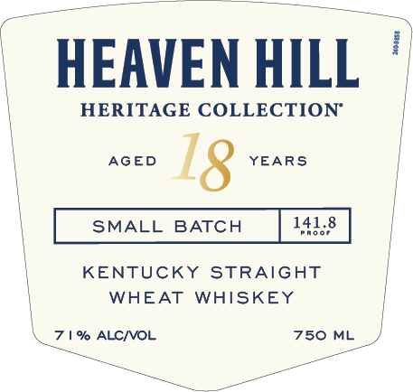
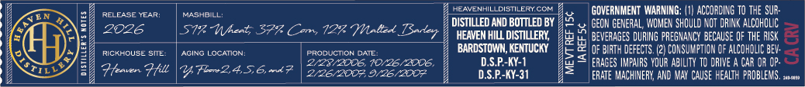
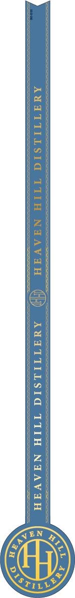

# TTB COLA Label Images - TTBID 26260001000580

**Brand Name:** HEAVEN HILL

**Fanciful Name:** SMALL BATCH

**Issue Date:** 09/21/2026

**Origin Code:** 22

**Product Class/Type:** 109

**Source:** [TTB Public COLA Registry](https://ttbonline.gov/colasonline/viewColaDetails.do?action=publicFormDisplay&ttbid=26260001000580)

## Label Images

### Label 1

### Label 2

### Label 3

### Label 4

## Extracted Label Text

*Text extracted via OCR - may contain errors*

*2 image(s) excluded: text did not meet readability threshold*

**Detected Age:** 18 Years

### Label 1

HEAVEN HILL
HERITAGE COLLECTION"
AGED
18
YEARS
SMALL
BATCH
141.8
FRo0F
KENTUCKY
STRAIGHT
WHEAT
WHISKEY
% ALCNOL
750
ML

### Label 2

HEAVENHILLDISTILERY. COM GOVERNMENT WARNING: (1) ACCORDING T0 THE SUR-

reLease year: | MASHOILL %
_ ee B DISTILLED AND BOTTLED BY / +. GEON GENERAL, WOMEN SHOULD NOT DRI ALCOROUC

2026 | STA Wheat) 577 Com 122 Weer Toocer | "yeppe au STILE, (5% eves DUNG PREGNANCY BEANE OF THE RMK =

moxHoUSE site, | AeiNo LocaTION | Proouenon ox BARDSTOWN, KENTUCKY <= oF RT DEFECTS, (2) CONSUMPTION OF ALCOHOI Ee —

2/23/2006, 10/26/2006,

s Z YOUR ABILITY TO ORWVE A CAR 08 P- —>
Plomor Flt | Y Foon. 5 mk? | Bae coe Ot RAGES IMPAIRS YOUR ABILITY TD ORIVE A CAR

= RATE MACHINERY, AND MAY CAUSE HEALTH PROBLEMS, sue
