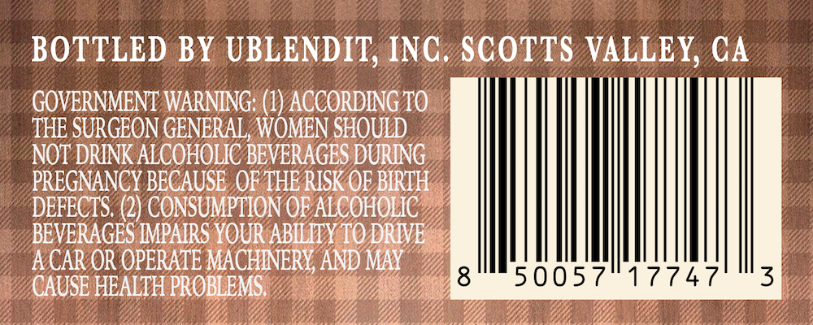
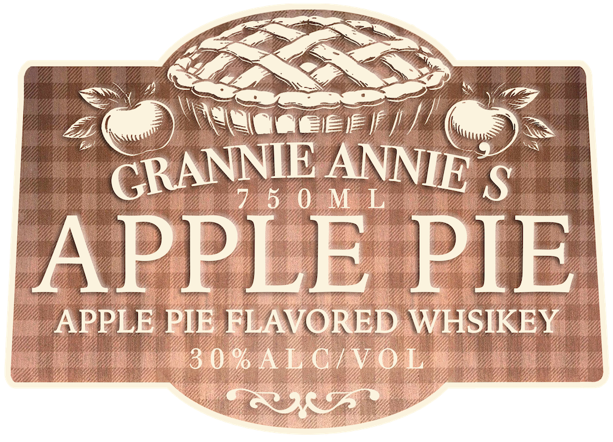

# TTB COLA Label Images - TTBID 26260001000646

**Brand Name:** GRANNIE ANNIE'S

**Issue Date:** 09/18/2026

**Origin Code:** 01

**Product Class/Type:** 149

**Source:** [TTB Public COLA Registry](https://ttbonline.gov/colasonline/viewColaDetails.do?action=publicFormDisplay&ttbid=26260001000646)

## Label Images

### Back Label

### Label 1

## Extracted Label Text

*Text extracted via OCR - may contain errors*

**Detected Proof:** 60

### Back Label

BOTTLED BY UBLENDIT; INC. SCOTTS VALLEY CA
GOVERNMENT WARNING: (1) ACCORDING TO
THE SURGEON GENERAL, WOMEN SHOULD
NOT DRINK ALCOHOLIC BEVERAGES DURING
PREGNANCY BECAUSE OF THE RISKOE BIRTH
DEFECTS (2) CONSUMPTION OF ALCOHOLIC
BEVERAGES [MPAIRS YOUR ABILITY TO DRIVE
ACAR OR OPERATE MACHINERY, AND MAY
CAUSE HEALTH PROBLEMS
8
50057
17747
3

### Label 1

LZ

Ree

LASS

SS:

a@)

\Wlegeer! ai cis py!

GRANN

IE: ANN

NSN

APPEE PIE

APPLE PIE BLAV RED WHSIKEY.

30%
