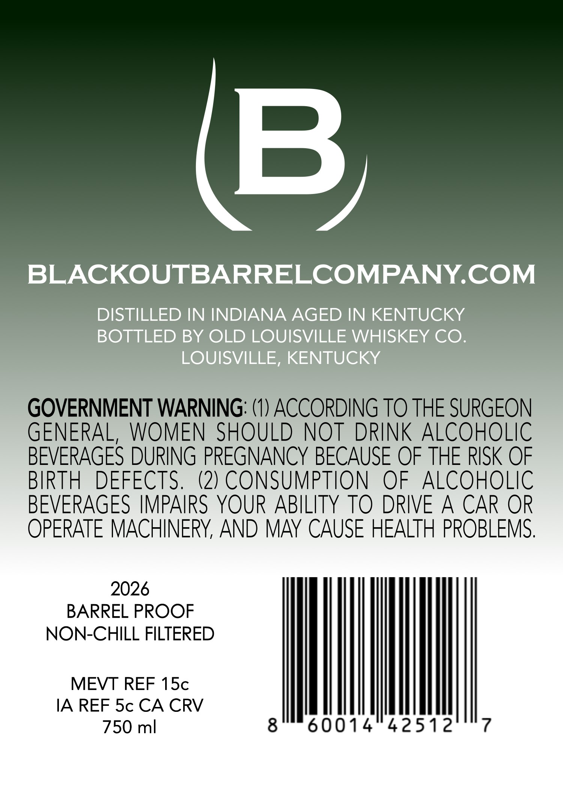
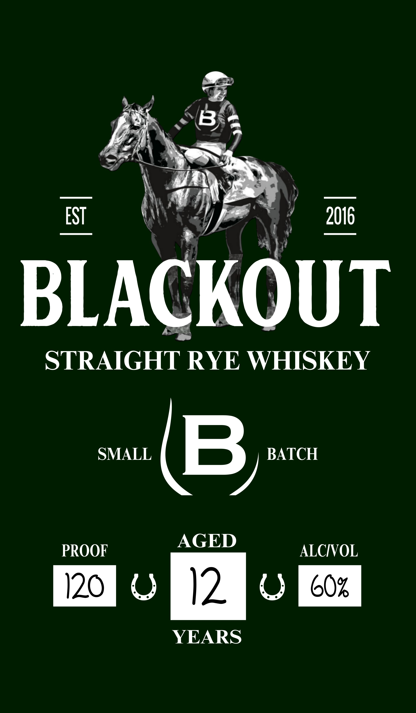

# TTB COLA Label Images - TTBID 26260001000659

**Brand Name:** BLACKOUT

**Issue Date:** 09/18/2026

**Origin Code:** 22

**Product Class/Type:** 102

**Source:** [TTB Public COLA Registry](https://ttbonline.gov/colasonline/viewColaDetails.do?action=publicFormDisplay&ttbid=26260001000659)

## Label Images

### Back Label

### Front Label

## Extracted Label Text

*Text extracted via OCR - may contain errors*

### Back Label

B
BLACKOUTBARRELCOMPANY.COM
DISTILLED IN INDIANA AGED IN KENTUCKY
BOTTLED BY OLD LOUISVILLE WHISKEY CO.
LOUISVILLE, KENTUCKY
GOVERNMENT WARNING: (1) ACCORDING TO THE SURGEON
GENERAL,
WOMEN SHOULD NOT DRINK ALCOHOLIC
BEVERAGES DURING PREGNANCY BECAUSE OF THE RISK OF
BIRTH
DEFECTS.
(2) CONSUMPTION
OF
ALCOHOLIC
BEVERAGES IMPAIRS YOUR ABILITY TO DRIVE A CAR OR
OPERATE MACHINERY, AND MAY CAUSE HEALTH PROBLEMS.
2026
BARREL PROOF
NON-CHILL FILTERED
MEVT REF 1Sc
IA REF Sc CA CRV
750 ml
8
60014
42512
7

### Front Label

~~ Bid

zp

\an

ST

(\\

206

BLA

KOUT

STRAIGHT | RYE WHISKEY

AGED

PROOF

ALCIVOL

120 ROR )2 RRR cox

YEARS
