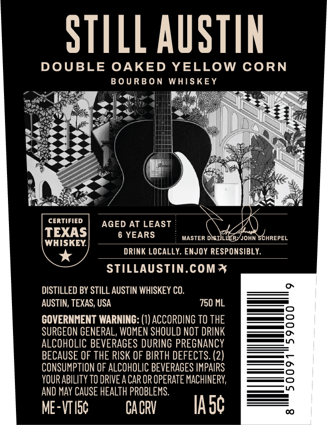
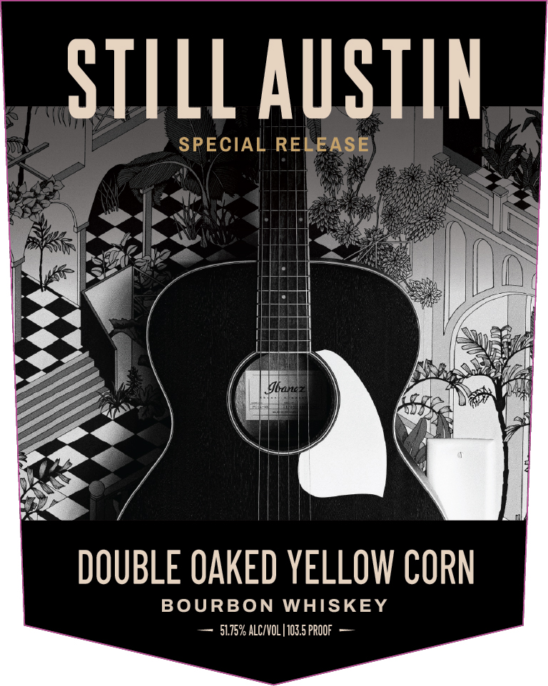

# TTB COLA Label Images - TTBID 26260001000666

**Brand Name:** STILL AUSTIN

**Fanciful Name:** SPECIAL RELEASE DOUBLE OAKED YELLOW CORN

**Issue Date:** 09/18/2026

**Origin Code:** 44

**Product Class/Type:** 141

**Source:** [TTB Public COLA Registry](https://ttbonline.gov/colasonline/viewColaDetails.do?action=publicFormDisplay&ttbid=26260001000666)

## Label Images

### Back Label

### Front Label

### Label 3

## Extracted Label Text

*Text extracted via OCR - may contain errors*

**Detected Proof:** 103.5
**Detected Age:** 6 Years

### Back Label

STILL AUSTIN
DOUBLE
OAKED YELLOW CORN
B 0 UR B 0 N
WHISKEY
CERTIFIED
AGED AT LEAST
TEXAS
6 YEARS
MASTER DISULLERYJOHN SCHREPEL
WHISKEY
DRINK LOCALLY. ENJOY RESPONSIBLY
STILLAUSTIN.COMI
DISTILLED BY STILL AUSTIN WHISKEY CO.
AUSTIN; TEXAS, USA
750 ML
GOVERNHENT WARNING: (1) ACCORDING TO THE
SURGEON GENEPAL, WOMEN SHOULD NOT DPINK
ALCOHOLIC BEVERAGES DURING PREGNANCY
BECAUSE OF THE RISK OF BIRTH DEFECTS: (2)
CONSUMPTION OF ALCOHOLIC BEVERAGES IMPAIRS
YOUR ABILITy TO DRIVEA CAR OR OPERATE MACHINERY;
AND May CAUSE HEALTH PROBLEMS:
ME-VTIsc
CACRV
IAsc

### Front Label

STILL AuSTiN
SPECIAL RELEASE
Sbanez
DOUBLE OAKED YELLOW CORN
BOURBON WHISKEY
51.75% ALC/VOL | 103.5 PROOF

### Label 3

100% TEXAS GROWN GRAINS

SNIVYS NMOUS SVXIL ZOOL
