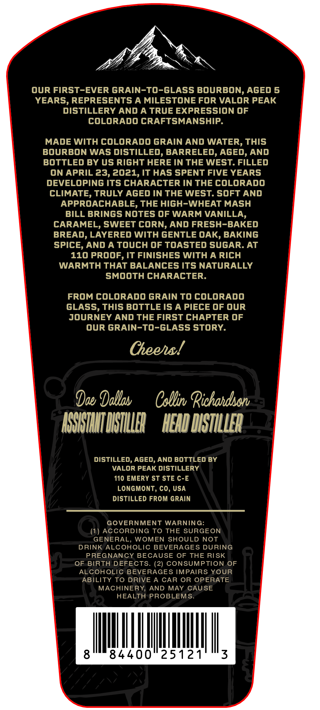
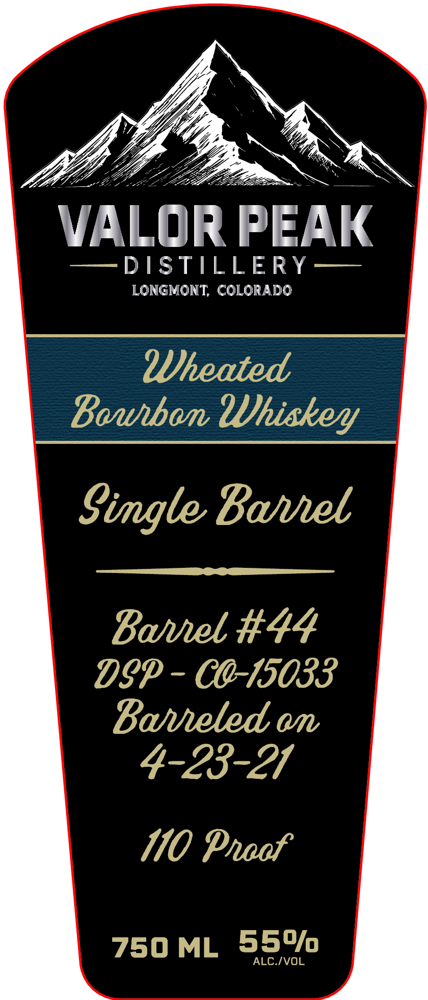

# TTB COLA Label Images - TTBID 26260001000668

**Brand Name:** VALOR PEAK DISTILLERY

**Issue Date:** 09/18/2026

**Origin Code:** 13

**Product Class/Type:** 141

**Source:** [TTB Public COLA Registry](https://ttbonline.gov/colasonline/viewColaDetails.do?action=publicFormDisplay&ttbid=26260001000668)

## Label Images

### Back Label

### Front Label

## Extracted Label Text

*Text extracted via OCR - may contain errors*

**Detected Proof:** 110
**Detected Age:** 5 Years

### Back Label

OuR FIRST-EVER GRAIN-TO-GLASS BOURBON, AGED 5
YEARS, REPRESENTS A MILESTONE FOR VALOR PEAK
DISTILLERY AND A TRUE EXPRESSION OF
COLORADO CRAFTSMANSHIP.
MADE WITH COLORADO GRAIN AND WATER, THIS
BOURBON WAS DISTILLED, BARRELED, AGED, AND
bottLed BY us Right HERE IN THE WEST. FILLED
ON APRIL 23,2021,IT HAS SPENT FIVE YEARS
DEVELOPING ITS CHARACTER IN THE COLORADO
CLIMATE
TRULY AGED IN THE WEST. SOFT AND
APPROACHABLE, THE HIGH-WHEAT MASH
BILL BRINGS NOTES OF WARM VANILLA,
CARAMEL, SWEET CORN, AND FRESH-BAKED
BREAD, LAYERED WITH GENTLE OAK, BAKING
SPIcE, AND A Touch OF ToAsTEd SUGAR. At
110 PROOF, IT FINISHES WITH A RICH
WARMTH THAT BALANCES ITS NATURALLY
SMOOTH CHARACTER:
FROM COLORADO GRAIN TO COLORADO
GLASS, This BOTTLE IS A PIECE OF OUR
JOURNEY AND THE FiRST CHAPTER OF
OUR GRAIN-TO-GLASS STORY:
Cheehal
Dae Dablab
Csllin Richahdscru
KMIILTIYTUE
HEADDISTILLER
DIStILLEd, AGed, AND BOTTLED BY
VALOR PEAK DISTILLERY
110 EMERY ST STE C-E
LONGMONT, CO, USA
DISTILLED FROM GRAIN
GOVERNMENT WARNING:
AccORDING TO THE SURGEON
GENERAL
WOMEN SHOULD NOT
DRINK ALCOHOLIC BEVERAGES DURING
PREGNANCY BECAUSE OF THE RISK
OF BIRTH DEFECTS_
(2) CONSUMPTION OF
ALCOHOLIC BEVERAGES IMPAIRS YOUR
ABILITY TO DRIVE
A CAR OR OPERATE
MACHINERY, AND MAY CAUSE
HEALTH PROBLEMS
8
84400
25121
3

### Front Label

VALOR PEAK
DSTILLERY
LONGMONT; COLORADO
?Dheated
Bawban UUhiskeyy
Simgle Bael
Bavel #44
Dgp - c@-15033
Baveled m
4-23-21
110 Pnaof
750 ML
55o/0
ALCIVOL
