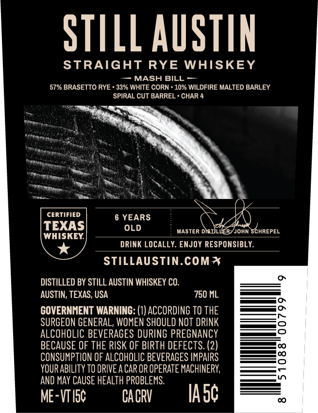
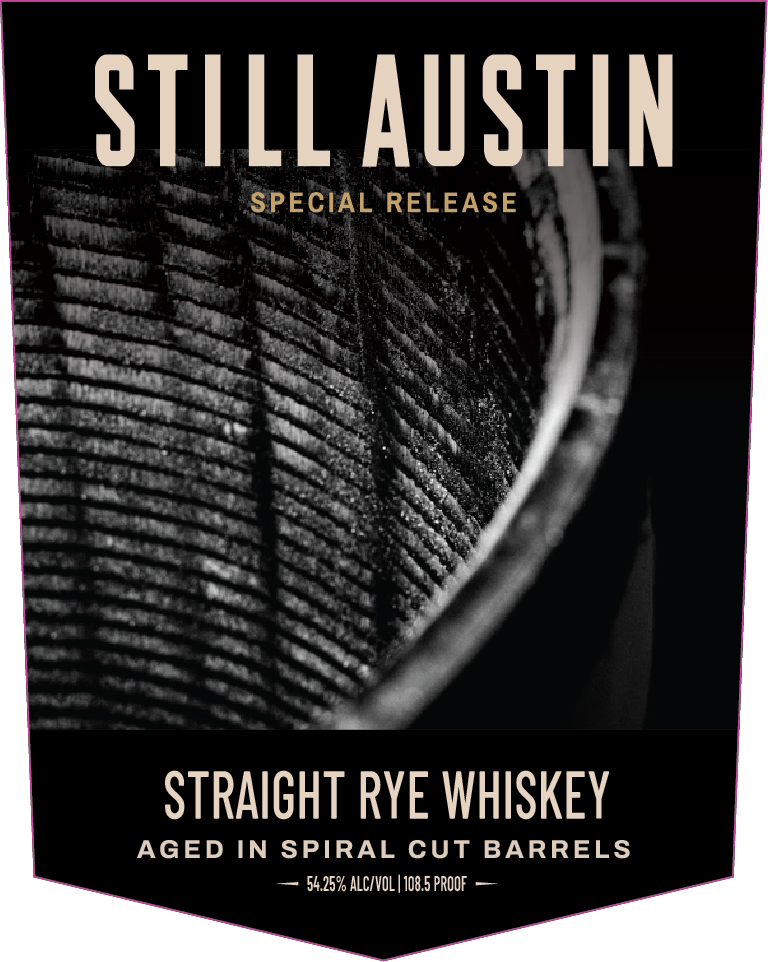

# TTB COLA Label Images - TTBID 26260001000670

**Brand Name:** STILL AUSTIN

**Fanciful Name:** SPECIAL RELEASE STRAIGHT RYE WHISKEY

**Issue Date:** 09/25/2026

**Origin Code:** 44

**Product Class/Type:** 102

**Source:** [TTB Public COLA Registry](https://ttbonline.gov/colasonline/viewColaDetails.do?action=publicFormDisplay&ttbid=26260001000670)

## Label Images

### Back Label

### Front Label

### Label 2

## Extracted Label Text

*Text extracted via OCR - may contain errors*

**Detected Proof:** 108.5
**Detected Age:** 6 Years

### Back Label

STILL AUSTIN
STRAIGHT
RYE
WHISKEY
MASH BILL
57% BRASETTO RYE * 33% WHITE CORN
10% WILDFIRE MALTED BARLEY
SPIRAL CUT BARREL * CHAR 4
CERTIFIED
6 YEARS
TEXAS
OLD
MASTER DISULLERYJOHN SCHREPEL
WHISKEY
DRINK LOCALLY. ENJOY RESPONSIBLY
STILLAUSTIN.COMI
DISTILLED BY STILL AUSTIN WHISKEY CO.
AUSTIN; TEXAS, USA
750 ML
GOVERNHENT WARNING: (1) ACCORDING TO THE
SURGEON GENEPAL, WOMEN SHOULD NOT DPINK
ALCOHOLIC BEVERAGES DURING PREGNANCY
BECAUSE OF THE RISK OF BIRTH DEFECTS: (2)
CONSUMPTION OF ALCOHOLIC BEVERAGES IMPAIRS
8
YOUR ABILITy TO DRIVEA CAR OR OPERATE MACHINERY;
AND May CAUSE HEALTH PROBLEMS:
ME-VTIsc
CACRV
IAsc

### Front Label

STILL AUSTIN
SPECIAL RELEASE
STRAIGHT RYE WHISKEY
AGED IN SPIRAL CUT BARRELS
54.25% ALCIVOL | 108.5 PROOF

### Label 2

100% TEXAS GROWN GRAINS

SNIVYS NMOUS SVXIL ZOOL
