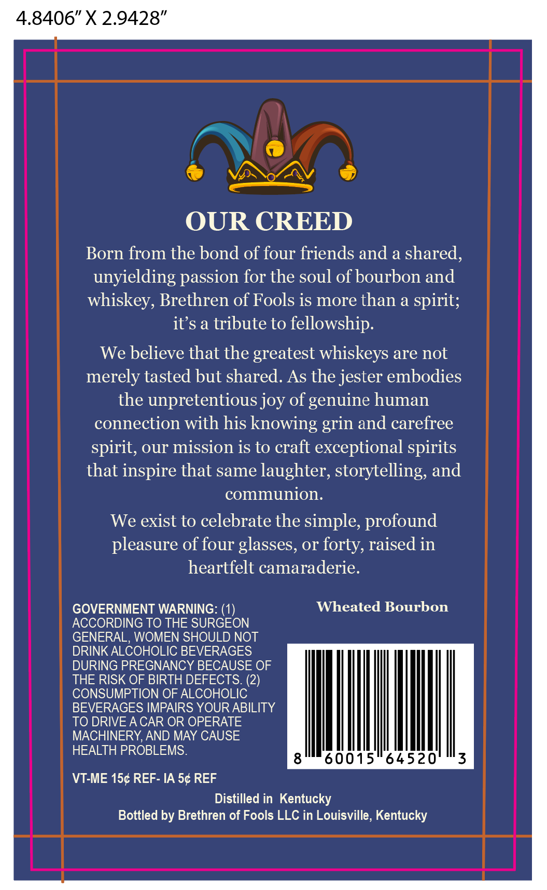
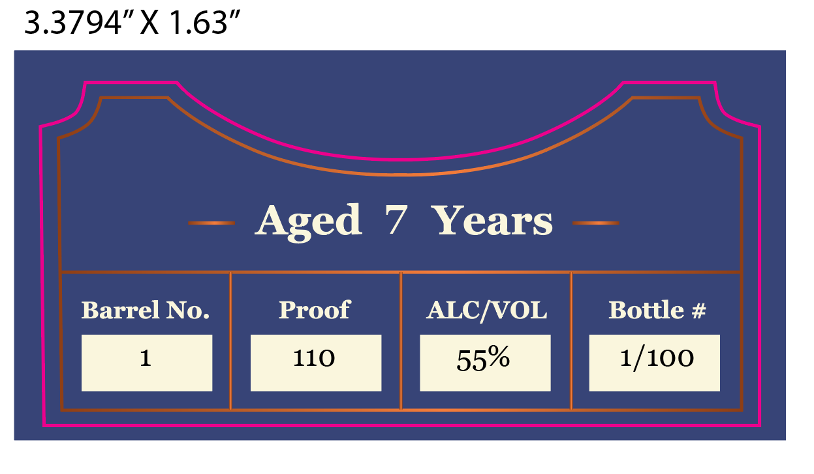

# TTB COLA Label Images - TTBID 26260001000679

**Brand Name:** BRETHREN OF FOOLS

**Issue Date:** 09/21/2026

**Origin Code:** 22

**Product Class/Type:** 141

**Source:** [TTB Public COLA Registry](https://ttbonline.gov/colasonline/viewColaDetails.do?action=publicFormDisplay&ttbid=26260001000679)

## Label Images

### Back Label

### Front Label

## Extracted Label Text

*Text extracted via OCR - may contain errors*

**Detected Proof:** 110
**Detected Age:** 7 Years

### Back Label

4.8406” X 2.9428”

LEN

OUR CREED

Born from the bond of four friends and a shared,
unyielding passion for the soul of bourbon and
whiskey, Brethren of Fools is more than a spirit;
it’s a tribute to fellowship.

We believe that the greatest whiskeys are not
merely tasted but shared. As the jester embodies
the unpretentious joy of genuine human
connection with his knowing grin and carefree

spirit, our mission is to craft exceptional spirits
that inspire that same laughter, storytelling, and
communion.

We exist to celebrate the simple, profound
pleasure of four glasses, or forty, raised in
heartfelt camaraderie.

GOVERNMENT WARNING: (1) Wheated Bourbon
ACCORDING TO THE SURGEON
GENERAL, WOMEN SHOULD NOT
DRINK ALCOHOLIC BEVERAGES
DURING PREGNANCY BECAUSE OF
THE RISK OF BIRTH DEFECTS. (2)
CONSUMPTION OF ALCOHOLIC
BEVERAGES IMPAIRS YOUR ABILITY
TO DRIVE ACAR OR OPERATE
MACHINERY, AND MAY CAUSE
HEALTH PROBLEMS.

VT-ME 15¢ REF- IA 5¢ REF

Distilled in Kentucky
Bottled by Brethren of Fools LLC in Louisville, Kentucky

### Front Label

3.3794"X 1.63"
Aged
7
Years
Barrel No.
Proof
ALCIVOL
Bottle #
110
1/100
55%
