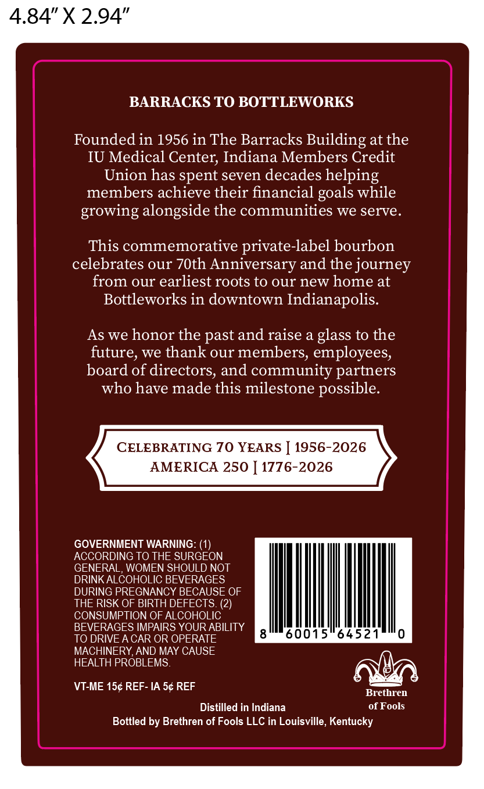
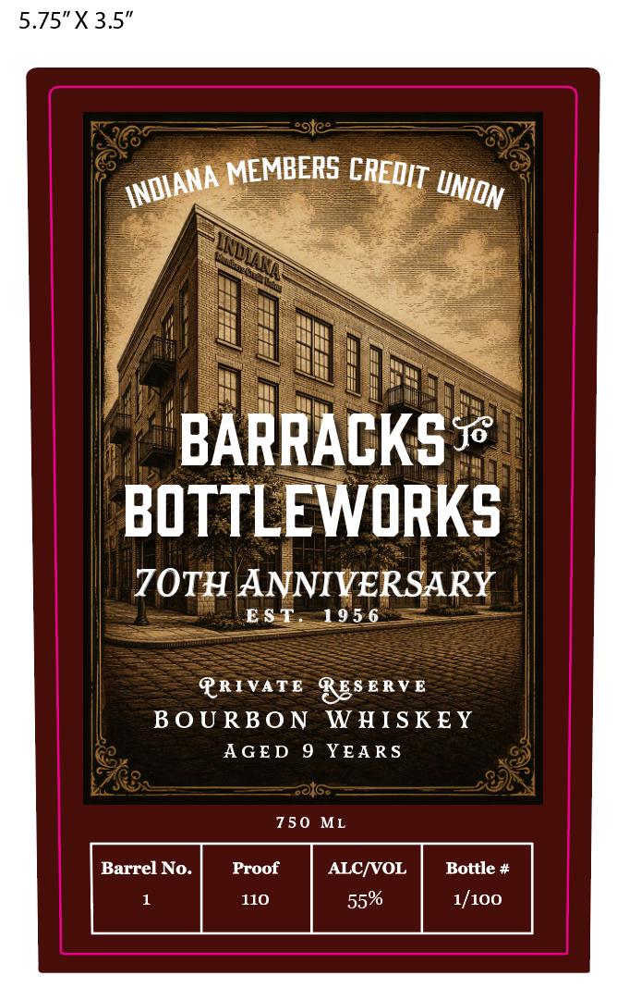

# TTB COLA Label Images - TTBID 26260001000685

**Brand Name:** BARRACKS TO BOTTLEWORKS

**Issue Date:** 09/19/2026

**Origin Code:** 22

**Product Class/Type:** 141

**Source:** [TTB Public COLA Registry](https://ttbonline.gov/colasonline/viewColaDetails.do?action=publicFormDisplay&ttbid=26260001000685)

## Label Images

### Back Label

### Label 1

## Extracted Label Text

*Text extracted via OCR - may contain errors*

**Detected Proof:** 110

### Back Label

4.84" X 2.94”

BARRACKS TO BOTTLEWORKS
Founded in 1956 in The Barracks Building at the
IU Medical Center, Indiana Members Credit
Union has spent seven decades helping
members achieve their financial goals while
growing alongside the communities we serve.
This commemorative private-label bourbon
celebrates our 70th Anniversary and the journey
from our earliest roots to our new home at
Bottleworks in downtown Indianapolis.

As we honor the past and raise a glass to the
future, we thank our members, employees,
board of directors, and community partners
who have made this milestone possible.
CELEBRATING 70 YEARS | 1956-2026
AMERICA 250 | 1776-2026

GOVERNMENT WARNING: (1)

ACCORDING TO THE SURGEON

GENERAL, WOMEN SHOULD NOT

DRINK ALCOHOLIC BEVERAGES

DURING PREGNANCY BECAUSE OF

THE RISK OF BIRTH DEFECTS. (2)

CONSUMPTION OF ALCOHOLIC

BEVERAGES IMPAIRS YOUR ABILITY

TO DRIVE A CAR OR OPERATE 860015 64521 0

MACHINERY, AND MAY CAUSE

HEALTH PROBLEMS Ata

VT-ME 15¢ REF- IA 5¢ REF iar
Distilled in Indiana of Fools

Bottled by Brethren of Fools LLC in Louisville, Kentucky

### Label 1

5.75"X3.5"
MEMBERS
BARRACKS J
BOTTLEWORKS
7OTH ANNIVERSARY
EST.
195 6
PRIVATE
Rgs E RV E
BoU RBO N
W HISKE Y
AGED
YEARS
750 ML
Barrel No.
Proof
ALCIVOL
Bottle #
110
55%
1/100
CREDIT
INDIANA
NION
