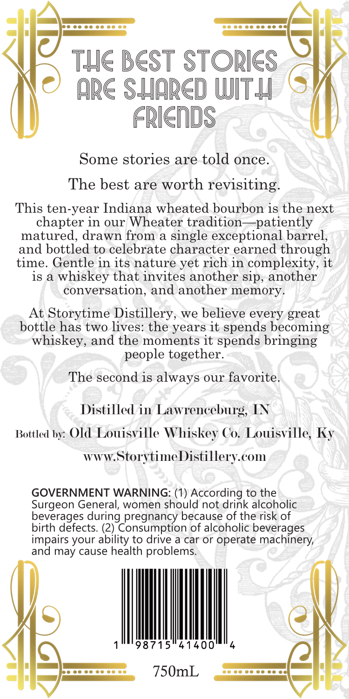
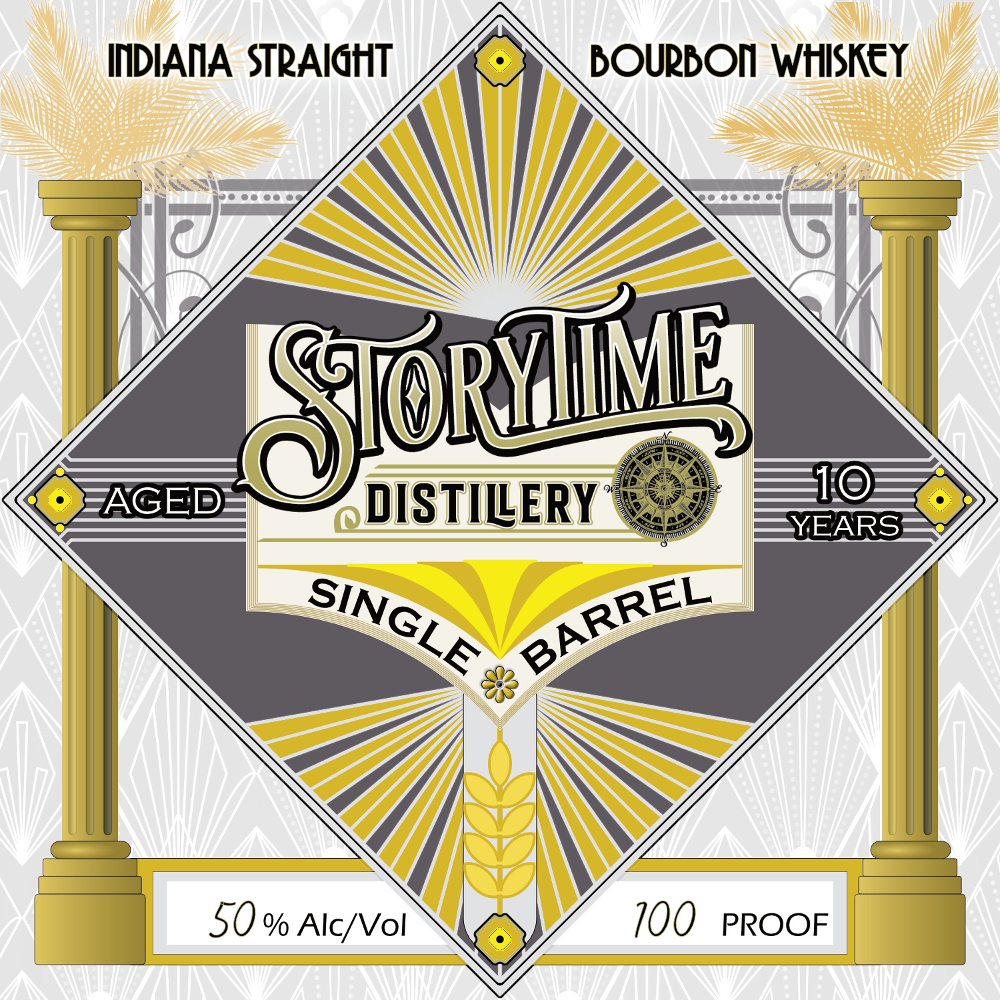

# TTB COLA Label Images - TTBID 26260001000702

**Brand Name:** STORYTIME

**Issue Date:** 09/19/2026

**Origin Code:** 22

**Product Class/Type:** 101

**Source:** [TTB Public COLA Registry](https://ttbonline.gov/colasonline/viewColaDetails.do?action=publicFormDisplay&ttbid=26260001000702)

## Label Images

### Back Label

### Label 1

## Extracted Label Text

*Text extracted via OCR - may contain errors*

**Detected Proof:** 100
**Detected Age:** 10 Years

### Back Label

Ie
Tle BeSt STORles
ARC Suarcd Witu
Friends
Some stories are told once_
The best are worth revisiting:
This ten-year Indiana wheated bourbon is the next
chapter in our Wheater tradition
patiently
matured, drawn from
single exceptional barrel,
and bottled to celebrate character earned through
time_
Gentle in its nature yet rich in complexity, it
is a
whiskey that invites another sip, another
conversation, and another memory_
At Storytime Distillery, we believe every great
bottle has two lives: the years it spends becoming
whiskey, and the moments it spends bringing
people together.
The second is always our favorite_
Distilled in Lawrencehurg, IN
Bottled by: Old Louisville
Whiskey Co. Luisville; Ky
WWW:
StorytimeDistillery cOm
GOVERNMENT WARNING: (1) According to the
Surgeon General; women should not drink alcoholic
beverages
pregnancy because of the risk of
birth defects. (2) Consumption of alcoholic beverages
impairs your ability to drive a car or operate machinery;
and
cause health problems.
98715"41400
750mL
during
may

### Label 1

INDIAIA STRAIHT
BOURBOI WtllSKEY
T@OE
AGED
DISTILERY
10
YEARS
50 % Alc/ Vol
100
PROOF
RYMME
BARREL
SINGLE
