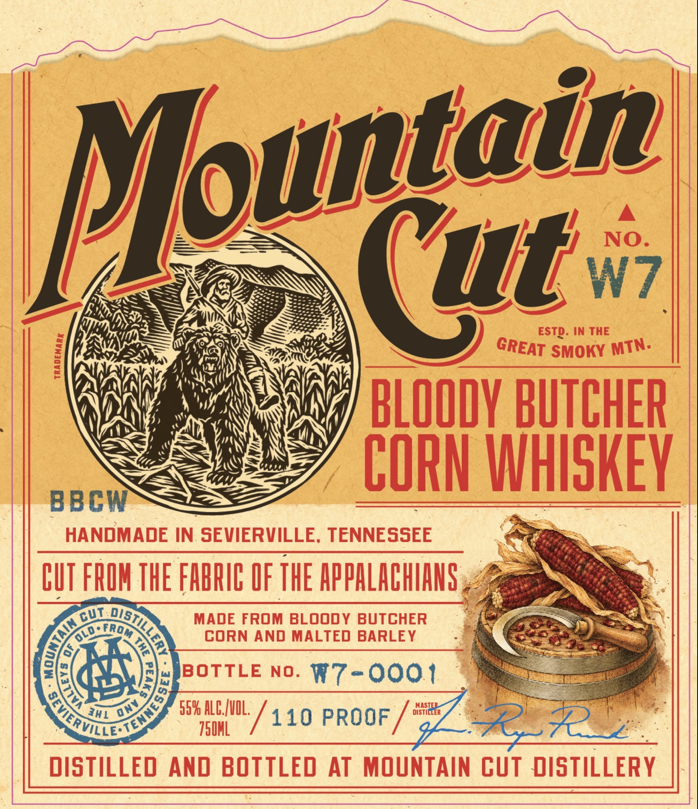
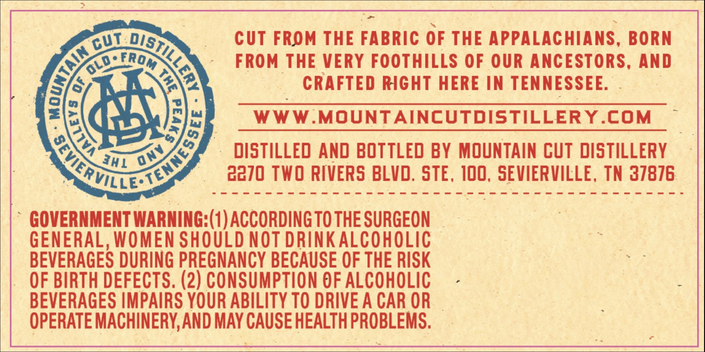

# TTB COLA Label Images - TTBID 26260001000730

**Brand Name:** MOUNTAIN CUT

**Fanciful Name:** BLOODY BUTCHER CORN WHISKEY

**Issue Date:** 09/25/2026

**Origin Code:** 43

**Product Class/Type:** 143

**Source:** [TTB Public COLA Registry](https://ttbonline.gov/colasonline/viewColaDetails.do?action=publicFormDisplay&ttbid=26260001000730)

## Label Images

### Label 1

### Label 2

## Extracted Label Text

*Text extracted via OCR - may contain errors*

**Detected Proof:** 110

### Label 1

NO
(ut
W7
ESTD:
IN THE
1
SMOKY
1
BLOODY BUTCHER
CORN WHISKEY
BBCW
HANDMADE IN SEVIERVILLE, TENNESSEE
CUT FRIH THE FHBRIC OF THE APPHLACHIANS
MADE FROM BLoody BUTCHER
CORN AND MALTED BARLEY
BOTTLE
NO_
R7-0oo1
559 ALEZvIL;
MASTER
750HL
110 PROOF
3272 ^
DISTILLED
And BOTTLED
AT MOUNTAIN CuT DISTILLERY
Mlountain
GREAT
MTN.
cut
0eur
TAIN
From
0LO
1
1
))
(WERMLLC
ony
341

### Label 2

CUT FROM THE FABRIC OF THE APPALACHIANS,
BORN
FROM THE VERY FOOTHILLS OF OUR ANCESTORS,
AND
6
CRAFTED RIGhT HERE IN TENNESSEE.
WWW MOUNTAINCUTDISTILLERY.COM
distilled And BOTTLED BY MOUNTAIN CUT DISTILLERY
2370 TWO RIVERS BLVD, STE , 100, SEVIERVILLE , TN 37876
GOVERNMENT WARNING:(1) ACCORDING TO THE SURGEON
GENERAL, WOMEN SHOULD NOT DRINKALCOHOLIC
BEVERAGES DURING PREGNANCY BECAUSE OF THE RISK
OF BIRTH DEFECTS. (2) CONSUMPTION €F ALCOHOLIC
BEVERAGES IMPAIRS YOUR ABILITY TO DRIVE A CAR OR
OPERATE MACHINERY,AND MAY CAUSE HEALTH PROBLEMS.
cut
0BtLLERr
(
From
OLo .
1
1
{
V2
onV
30L
