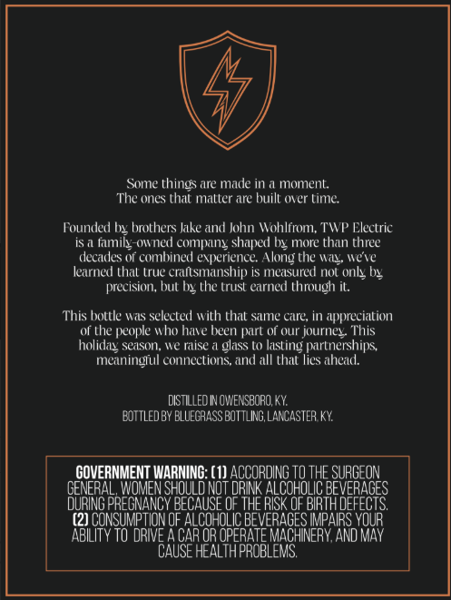
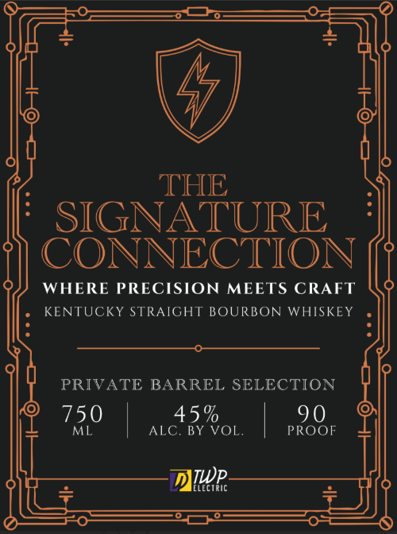

# TTB COLA Label Images - TTBID 26260001000788

**Brand Name:** THE SIGNATURE CONNECTION

**Issue Date:** 09/18/2026

**Origin Code:** 22

**Product Class/Type:** 101

**Source:** [TTB Public COLA Registry](https://ttbonline.gov/colasonline/viewColaDetails.do?action=publicFormDisplay&ttbid=26260001000788)

## Label Images

### Back Label

### Front Label

## Extracted Label Text

*Text extracted via OCR - may contain errors*

**Detected Proof:** 90

### Back Label

Some things are made in
moment
The ones that matler are built (ver tine
Founded bnx brothers Jake and John Wohlfrom; TWP Electric
famil-owned compang shaped by more than three
decaces or comhined @ perience Along the WaL "ete
learned thal true crallsmanship iS measured nol Only VL
precision; but bg the trust Carnet thrvugh il.
This bottle Wis selected with that Same care; in appreciation
Of the people who have been part Of our journez This
holiday season; "e raise
glass to lasting partnerships
meaninglul connections; and all thiut lies ahead.
dISTLLLeD IN OWENSBORO;, KY:
EDTTLEDBY BLUECRASS BOTTLING, LANCASTER KY
GOVERNMENT WARNING: (1) ACCORDING To THE SURGEON
GENERAL, WoMen SHOuld not DRIK ALCOHoLIC BEVERAGES
DuRING PREGNANCY BECAUSE OF THE RISK OF BIRTH DEFECTS
(2) CONSUMPTION OF
GAF OROPEFEATERaCeSeRPARKD OUP
ABILITY TO DRIE A
OR OPERATE MACHINERY; AND MAY
CAUSE HEALTHPROBLEMS

### Front Label

THE
SIGNATURE
CONNECTION
WHERE PRECISION
MEETS CRAFT
KENTUCKY STRAIGHT BOURBON WHISKEY
PRIVATE BARREL SELECTION
750
45 %
90
ML
ALC. BY VOL.
PROOF
TWp
lectric
