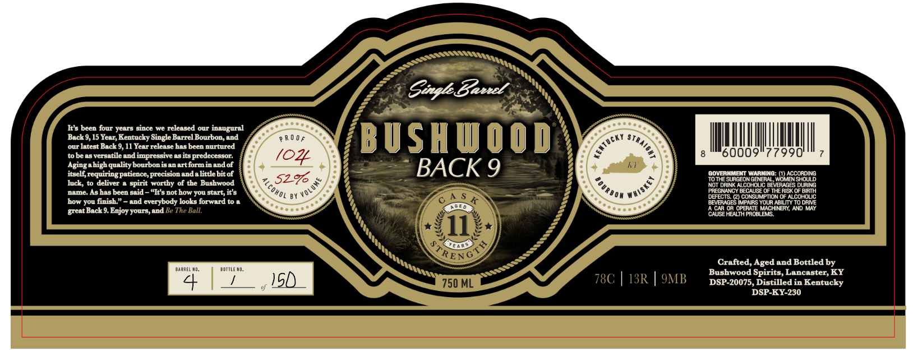

# TTB COLA Label Images - TTBID 26260001000797

**Brand Name:** BUSHWOOD

**Issue Date:** 09/23/2026

**Origin Code:** 22

**Product Class/Type:** 101

**Source:** [TTB Public COLA Registry](https://ttbonline.gov/colasonline/viewColaDetails.do?action=publicFormDisplay&ttbid=26260001000797)

## Label Images

### Label 1

## Extracted Label Text

*Text extracted via OCR - may contain errors*

**Detected Age:** 15 Years

### Label 1

It’s been four years since we released our inaugural
Back 9, 15 Year, Kentucky Single Barrel Bourbon, and
our latest Back 9, 11 Year release has been nurtured
tobe as versatile and impressive as its predecessor.
Aging ahigh quality bourbon isan artformin and of
itself, requiring patience, precision and alittle bit of
Tuck, to deliver a spirit worthy of the Bushwood
name. As has been said “It's not how you start, it's
how you finish.” ~ and everybody looks forward to a
great Back 9. Enjoy yours, and

uanet a0,

Single Zavecl

BUSHWOOD

8

‘60009°77990

GOVERNMENT WARNING: (1) ACCORDING
‘TOTHE SURGEON GENERAL, WOMEN SHOULD
NOT DRINK ALCOHOUC BEVERAGES DURING
PREGRANCY BECALISE OF THE RISK OF BIH
DEFEOTS. @) CONSUMPTION OF ALCOHOUC
BEVERAGES IMPAIRS YOUR ABILITY TO DRIVE
'A-CAR OR OPERATE MACHINERY, AND MAY
CAUSE HEALTH PROBLEMS,

7

Grafted, Aged and Bottled by

Bushwood Spirits, Lancaster, KY

DSP-20075, Distilled in Kentucky
DSP-KY-230
