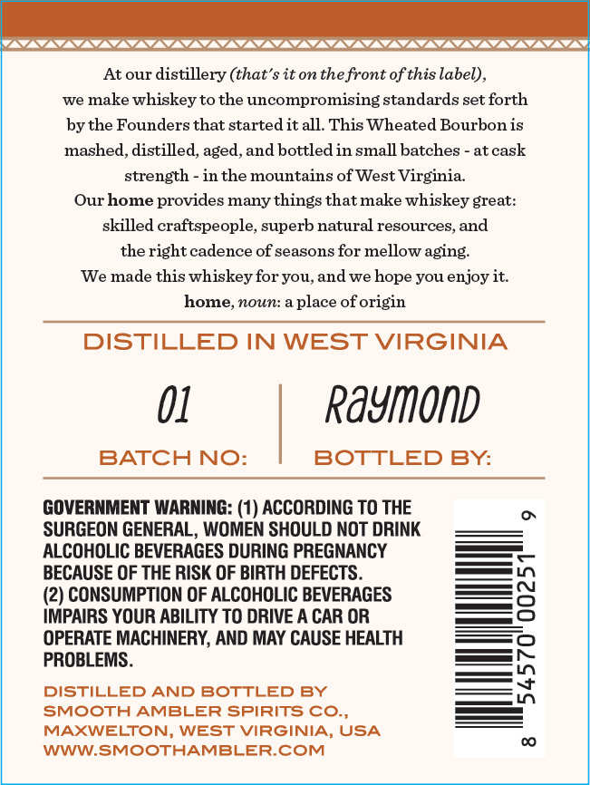
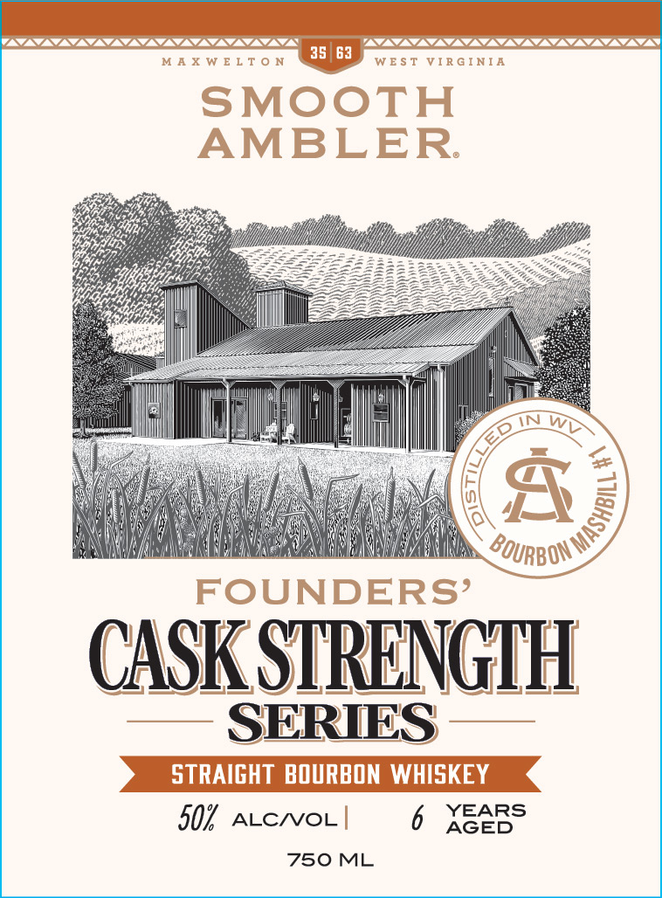

# TTB COLA Label Images - TTBID 26260001000802

**Brand Name:** SMOOTH AMBLER

**Issue Date:** 09/18/2026

**Origin Code:** 47

**Product Class/Type:** 101

**Source:** [TTB Public COLA Registry](https://ttbonline.gov/colasonline/viewColaDetails.do?action=publicFormDisplay&ttbid=26260001000802)

## Label Images

### Back Label

### Front Label

## Extracted Label Text

*Text extracted via OCR - may contain errors*

### Back Label

SSC SCSCSCSCSCSCSL SSL SSS SSL SSNS SS

At our distillery (that’s it on the front of this label),
we make whiskey to the uncompromising standards set forth
by the Founders that started it all. This Wheated Bourbon is
mashed, distilled, aged, and bottled in small batches - at cask
strength - in the mountains of West Virginia.
Our home provides many things that make whiskey great:
skilled craftspeople, superb natural resources, and
the right cadence of seasons for mellow aging.
‘We made this whiskey for you, and we hope you enjoy it.
home, noun: a place of origin

DISTILLED IN WEST VIRGINIA

01 Raymond

BATCH NO: BOTTLED By:

GOVERNMENT WARNING: (1) ACCORDING TO THE
SURGEON GENERAL, WOMEN SHOULD NOT DRINK
ALCOHOLIC BEVERAGES DURING PREGNANCY
BECAUSE OF THE RISK OF BIRTH DEFECTS.

(2) CONSUMPTION OF ALCOHOLIC BEVERAGES
IMPAIRS YOUR ABILITY TO DRIVE A CAR OR
OPERATE MACHINERY, AND MAY CAUSE HEALTH
PROBLEMS.

DISTILLED AND BOTTLED BY
SMOOTH AMBLER SPIRITS CO.,
MAXWELTON, WEST VIRGINIA, USA
WWW.SMOOTHAMBLER.COM

9

Iu wh

8

### Front Label

35| 63
M A X W E L T 0 N
W E $ T
VIR G I NIA
SMOOTH
AMBLER
FOUNDERS'
CASK SIRENGHH
SERIES
STRAIGHT BOURBON WHISKEY
507
ALCNOL |
6
XGEBs
750 ML
WV
)
BOURBON
