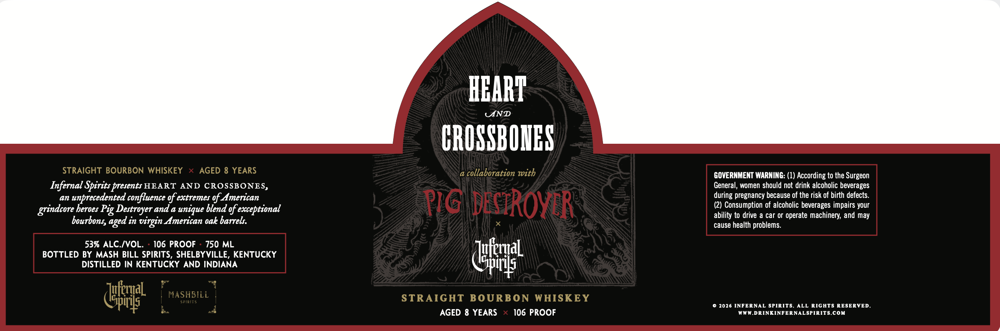

# TTB COLA Label Images - TTBID 26260001000850

**Brand Name:** INFERNAL SPIRITS

**Issue Date:** 09/19/2026

**Origin Code:** 22

**Product Class/Type:** 101

**Source:** [TTB Public COLA Registry](https://ttbonline.gov/colasonline/viewColaDetails.do?action=publicFormDisplay&ttbid=26260001000850)

## Label Images

### Label 1

## Extracted Label Text

*Text extracted via OCR - may contain errors*

**Detected Proof:** 106
**Detected Age:** 8 Years

### Label 1

HBART
UND
CROSSBOIES
STRAIGHT BOURBON WHISKEY
AGED 8 YEARS
collaboration with
GOVERNMENT WARNING: (1) According to the Surgeon
Infernal Spirits presents HEART AND CROSSBONES,
General, women should not drink alcoholic beverages
an
unprecedented confluence of extremes of American
during pregnancy because of the risk of birth defects.
heroes Pig Destroyer and a unique blend of exceptional
PIG DEcRovtR
Consumption of alcoholic beverages impairs your
ability to drive
car or operate machinery; and may
bourbons,
in virgin American ok barrels.
cause health problems:
53% ALC /VOL.
106 PROOF
750 ML
BOTTLED BY MASH BILL SPIRITS, SHELBYVILLE, KENTUCKY
dfat
DISTILLED IN KENTUCKY AND INDIANA
dfaal
MASHBILL
SptRits
STRAIGHT BOURBON WHISKEY
2026 INFERNAL SPIRITS
ALL RIGHTS RESERVED_
AGED 8 YEARS
106 PROOF
WWRDRINKINFERNALSPIRITS.COM
grindcore _
aged _
