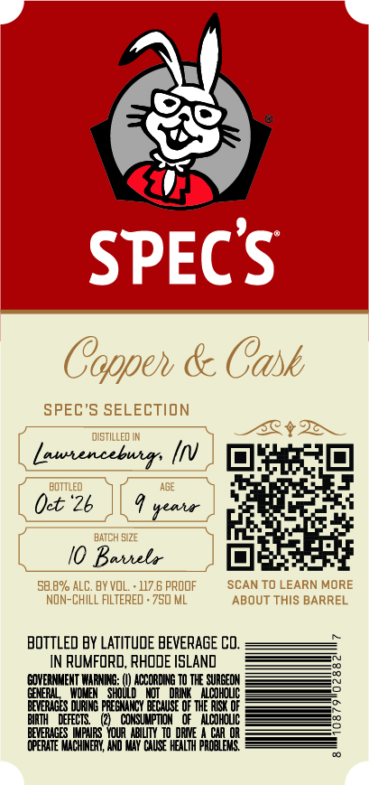
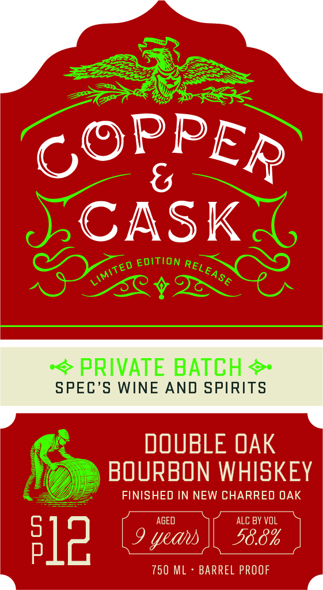

# TTB COLA Label Images - TTBID 26261001000116

**Brand Name:** COPPER & CASK

**Issue Date:** 09/18/2026

**Origin Code:** 40

**Product Class/Type:** 141

**Source:** [TTB Public COLA Registry](https://ttbonline.gov/colasonline/viewColaDetails.do?action=publicFormDisplay&ttbid=26261001000116)

## Label Images

### Back Label

### Front Label

### Label 3

## Extracted Label Text

*Text extracted via OCR - may contain errors*

**Detected Proof:** 117.6

### Back Label

SPECS
Coppeh & Cask
SPEC'S SELECTION
dIstILLED IN
Launenceburs
BOTTLED
Oet *2b
#eaia
BATCH SI2E
Baihela
5B.8% ALC. BY VOL
117.6 PROOF
SCAN TO LEARN MORE
NOn-ChILL FILTERED . 750 ML
ABOUT THIS BARREL
BOTTLeD BY LATITUDE BEVERAGE Co.
IN RUMFORD, RHODE ISLAnd
EONERMMEMNT WARNIG:
ACCORDING T0 THE SURGEOM
GENERN
E
DAIL'Acdhoug
BEVERICES
BEEETECH EEcWC O HHERCTO
BIRTH
FFECTS
CONSUMPTION
acohouc
0oBRE Lnz Youa LiW
DRME
CaR OR
@FERHTE MCHIEY Ro vly Chuse HEALTH proaiEMs

### Front Label

CASK
EDITION
PRIVATE BATCH
SPEC'S WINE AND SPIRITS
DOUBLE OAK
BOURBON WHISKEY
FINISHED IN NEW CHARRED OAK
AGED
ALC BY
F12
9
58.8%
750 M
BARREL PROOF
PPER
C(
RELI
LIMITED
-EASE
Vol
yeau

### Label 3

COPPER & CASK Say

MSW 8 WdddOd

a=
