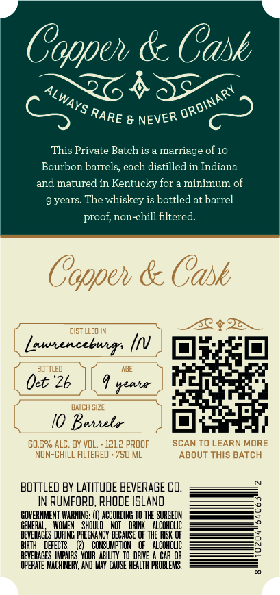
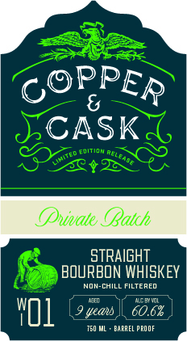

# TTB COLA Label Images - TTBID 26261001000121

**Brand Name:** COPPER & CASK

**Issue Date:** 09/18/2026

**Origin Code:** 40

**Product Class/Type:** 141

**Source:** [TTB Public COLA Registry](https://ttbonline.gov/colasonline/viewColaDetails.do?action=publicFormDisplay&ttbid=26261001000121)

## Label Images

### Back Label

### Front Label

### Label 3

## Extracted Label Text

*Text extracted via OCR - may contain errors*

**Detected Proof:** 121.2
**Detected Age:** 9 Years

### Back Label

Coppeh & Cask
2640
This Private Batch is
marriage of 10
Bourbon barrels; each distilled in Indiana
and matured in Kentucky for a minimum of
9 years. The whiskey is bottled at barrel
proof; non-chill filtered
Coppeh & Cask
dIstILLED IN
Lautencebuirs
QEE
BOTTLED
(ct '"26
#eaia
BATCH SI2E
Baihela
60.6% ALC. BY VOL
12L.z PROOF
SCAN TO LEARN MORE
NOn-ChILL FILTERED . 750 ML
ABOUT ThIS BATCH
BOTTLED BY LATITUDE BEVERAGE Cd.
IN RUMFORD, RHODE ISLAND
GOVERNMENT WARNING:
ACCORDING TO THE SURGEOH
GENERAD
SHOUL
DHI
ALCOHOLIC
BEVERAGES
E
PREGNANCY BECAUSE OF thE RESK OF
BIRTH
DEFECTS
CONSUMPTION   Of   Alcoholic
BEVERAGES IMIPAIRS  VOUR  abilITY
Daie
CAR OR
OPERATE MACHINERY, AND MAY CHuse HEALTH PROBLEYG
ALWAYS
ORDINARY
RARE
NEVER

### Front Label

CASK
hmnn
2
(uvate (Batch
stRaIGHT
BOURBON WHISKEY
NON-CHILL FILTERED
Danti
wo1
uecu
60.62
750 ML
BAPREL PPOOF
PPER
aeleabe
Ited

### Label 3

COPPER & CASK Say

MSW 8 WdddOd

a=
