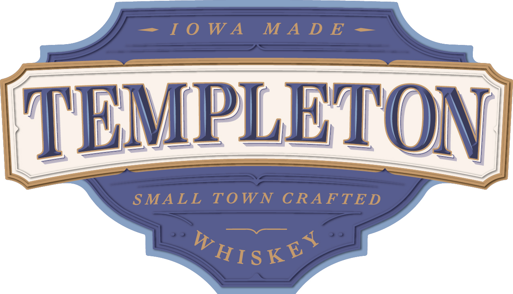
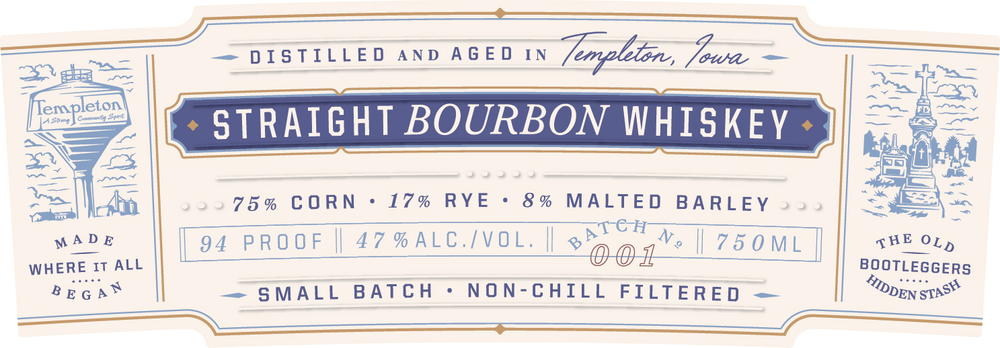
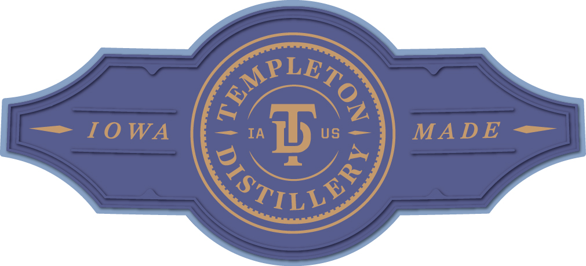

# TTB COLA Label Images - TTBID 26261001000191

**Brand Name:** TEMPLETON

**Issue Date:** 09/19/2026

**Origin Code:** 20

**Product Class/Type:** 101

**Source:** [TTB Public COLA Registry](https://ttbonline.gov/colasonline/viewColaDetails.do?action=publicFormDisplay&ttbid=26261001000191)

## Label Images

### Back Label

### Label 1

### Label 2

### Label 4

### Label 5

### Label 6

## Extracted Label Text

*Text extracted via OCR - may contain errors*

*3 image(s) excluded: text did not meet readability threshold*

**Detected Proof:** 94

### Back Label

DISTILLED AND BOTTLED BY TEMPLETON DISTILLERY
TEMPLETON, IOWA USA

GOVERNMENT WARNING: (1) ACCORDING TO THE SURGEON
GENERAL, WOMEN SHOULD NOT DRINK ALCOHOLIC
BEVERAGES DURING PREGNANCY BECAUSE OF THE RISK OF
BIRTH DEFECTS. (2) CONSUMPTION OF ALCOHOLIC
BEVERAGES IMPAIRS YOUR ABILITY TO DRIVE A CAR OR
OPERATE MACHINERY, AND MAY CAUSE HEALTH PROBLEMS.

W5¢-ME 15¢-V115¢-(CA CRY

WWW.TEMPLETONDISTILLERY.COM b>

### Label 1

I 0 W A
M A D E
TEMPLETON
SMALL
TOWN CRAFTE D
WHISKEA

### Label 2

————"

pzene

a

DISTILLED AND AGED IN Lonyion, Je 7

p=

a

empleton)

fot

Sa fe

—— ja

ee

Fey aa)

os

ri

\

| ence BOURBON WHISKEY

2222332

—

3

ss

men

.75% CORN

L7% IRV E

8% MALTED BARLEY

ee)

«ff

MADE

pl CH

WHERE IT ALL

94 PROOF || 47%ALC./VOL. ||

2 OOR

Vo | 750M |

BOOTLEGGERS

sHE OL,

BrGa*

— SMALL BATCH

NON-CHILL FILTERED —

DEN eras
