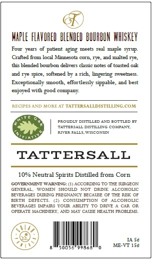
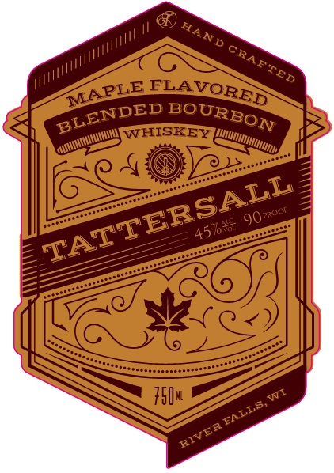

# TTB COLA Label Images - TTBID 26261001000194

**Brand Name:** TATTERSALL

**Fanciful Name:** MAPLE FLAVOR

**Issue Date:** 09/24/2026

**Origin Code:** 48

**Product Class/Type:** 149

**Source:** [TTB Public COLA Registry](https://ttbonline.gov/colasonline/viewColaDetails.do?action=publicFormDisplay&ttbid=26261001000194)

## Label Images

### Back Label

### Front Label

## Extracted Label Text

*Text extracted via OCR - may contain errors*

### Back Label

hapLe FLAVORED  BLENIED BOURBIN WHISKEY
Fowr   Years
pitent #ging
meers
red maple STUP
Crfted fom local Minne oz
COTD
ad malted 1je;
this blended boubon delivers clusic notes
toisted okk
Tye spice, softened by
rich; lingering
7yeetes;
Exceptionally sooth
effortlessly siPpable,
best
enjoyed with
compiny:
RECIPES AND MORE AT TATTERSALLDISTLLING CUM
PROUDLT DETILLED AND 30TTLET
TETTTEFRALL DSILMC
Colpact
3ER FALLS
WICOXSC;
TATTERSALL
10% Neutral Spirits Distilled from Corn
GOTTRNNETWAPATRG
CCCOPDNCTC
TLE JdGoy
GENERLLL
ITONEN
SHOULD
NOT
DRIIK
ALCOHOLIC
3E  ERAC
DIDMC PPFGYNG BECAIT
Tfz Aea
BIRTH
DEFECTS
CONSUN?TION
ALCOHOLIC
Bzaidaees
z Ff
A(lme
AElI
Ienaf
OPELTE
MACHNNERT AND MAT
CALEE HEALTH FROBLEMS
I4 54
0054
99547
ME-VT 154
geod

### Front Label

WHISKEY
#50u
Kt
HAND
CRAF
TED
FLAVORED
MAPLE
BLENDED
BOURBON
TATTERSALL
9Orroor
459685
FALLS;
RIVER
