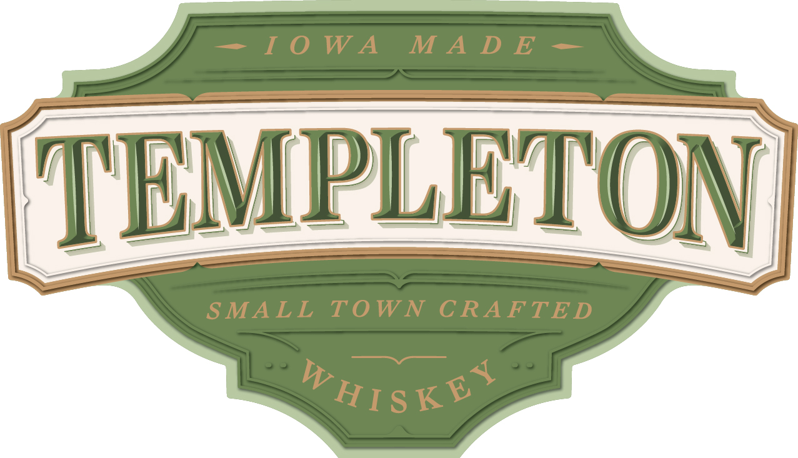
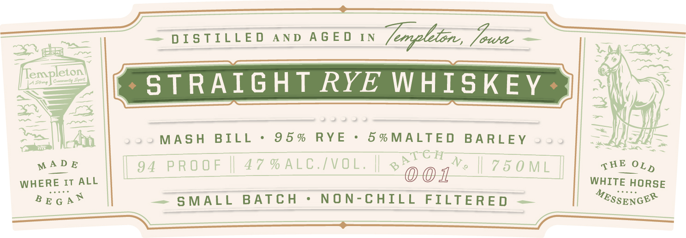
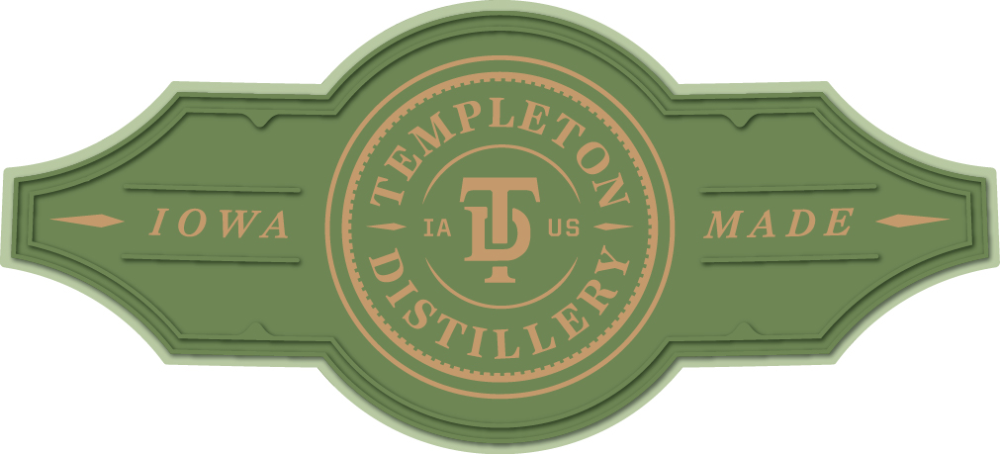

# TTB COLA Label Images - TTBID 26261001000201

**Brand Name:** TEMPLETON

**Issue Date:** 09/19/2026

**Origin Code:** 20

**Product Class/Type:** 102

**Source:** [TTB Public COLA Registry](https://ttbonline.gov/colasonline/viewColaDetails.do?action=publicFormDisplay&ttbid=26261001000201)

## Label Images

### Back Label

### Label 1

### Label 2

### Label 4

### Label 5

### Label 6

## Extracted Label Text

*Text extracted via OCR - may contain errors*

*3 image(s) excluded: text did not meet readability threshold*

**Detected Proof:** 94

### Back Label

DISTILLED AND BOTTLED BY TEMPLETON DISTILLERY
TEMPLETON, IOWA USA

GOVERNMENT WARNING: (1) ACCORDING TO THE SURGEON
GENERAL, WOMEN SHOULD NOT DRINK ALCOHOLIC
BEVERAGES DURING PREGNANCY BECAUSE OF THE RISK OF
BIRTH DEFECTS. (2) CONSUMPTION OF ALCOHOLIC
BEVERAGES IMPAIRS YOUR ABILITY TO DRIVE A CAR OR
OPERATE MACHINERY, AND MAY CAUSE HEALTH PROBLEMS.

W5¢-ME 15¢-V115¢-(CA CRY

WWW.TEMPLETONDISTILLERY.COM b>

### Label 1

—- LTLOWA MADE —

TEM

~

$=

ETON

JN

MPLET

SMALL TOWN CRAFTED

~~

PIs Kt

### Label 2

ate “DISTILLED AND AGED IN OS = —=———
= | ~J 53 Ww

BY STRAIGHT RYE WHISKEY >

MASH BILL +: 95% RYE: paNM ALT Et BARLEY

mn Aa |
cel NAO |
ne ms

50M SBE OL,

MADE | 94 PROOF || 47 %ALC./VOl | 750ML
WHERE IT ALL — oon : | WHITE HORSE
Bega® — SMALL BATCH - NON-CHILL FILTERED — | “essenos™
