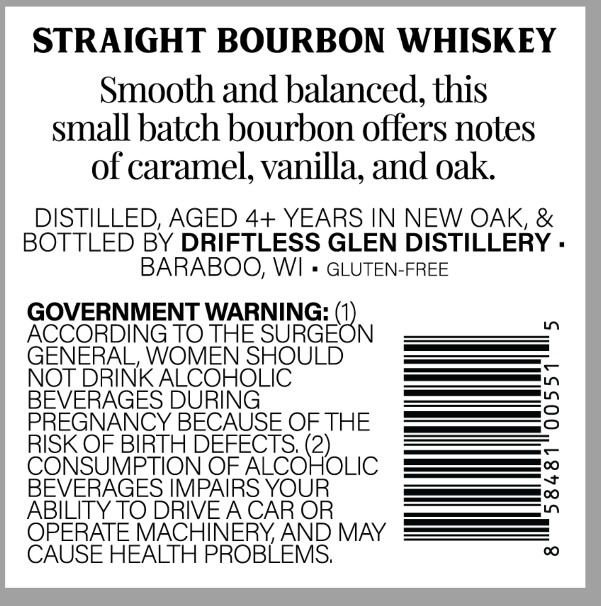
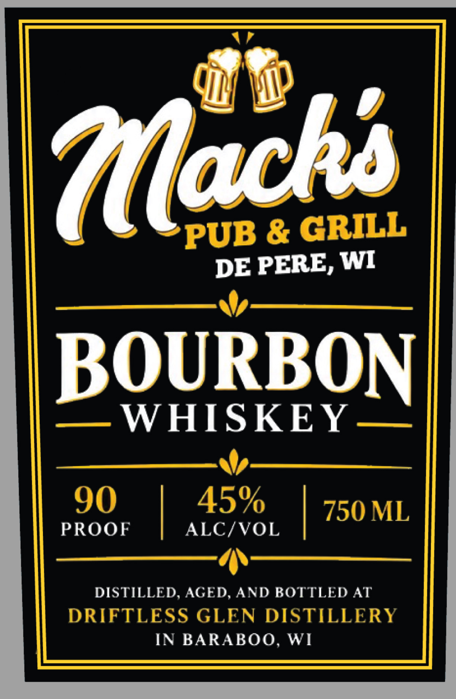

# TTB COLA Label Images - TTBID 26261001000205

**Brand Name:** MACK'S PUB & GRILL

**Issue Date:** 09/19/2026

**Origin Code:** 48

**Product Class/Type:** 141

**Source:** [TTB Public COLA Registry](https://ttbonline.gov/colasonline/viewColaDetails.do?action=publicFormDisplay&ttbid=26261001000205)

## Label Images

### Back Label

### Front Label

## Extracted Label Text

*Text extracted via OCR - may contain errors*

**Detected Proof:** 90

### Back Label

STRAIGHT BOURBON WHISKEY
Smooth and balanced; this
small batch bourbon offers notes
of caramel, vanilla, and oak
DISTILLED, AGED 4+ YEARS IN NEW OAK, &
BOTTLED BY DRIFTLESS GLEN DISTILLERY .
BARABOO, WI
GLUTEN-FREE
GOVERNMENT WARNING:
L
ACCORDING TO THE SURGEON
GENERAL, WOMEN SHOULD
NOT DRINK ALCOHOLIC
BEVERAGES DURING
3
PREGNANCY BECAUSE OF THE
RISK OF BIRTH DEFECTS (2)_
C
CONSUMPTION OF ALCOHOLIC
BEVERAGES IMPAIRS YOUR
:
ABILITY TO DRIVEA CAR OR
OPERATE MACHINERYAND MAY
CAUSE HEALTH PROBLEMS;
0

### Front Label

Aachs
PUB & GRILL
DE PERE, WI
BOURBON
WHISKEY
90
45%
750 ML
PROOF
ALC/VOL
DISTILLED, AGED, AND BOTTLED AT
DRIFTLESS GLEN DISTILLERY
IN BARABOO, WI
