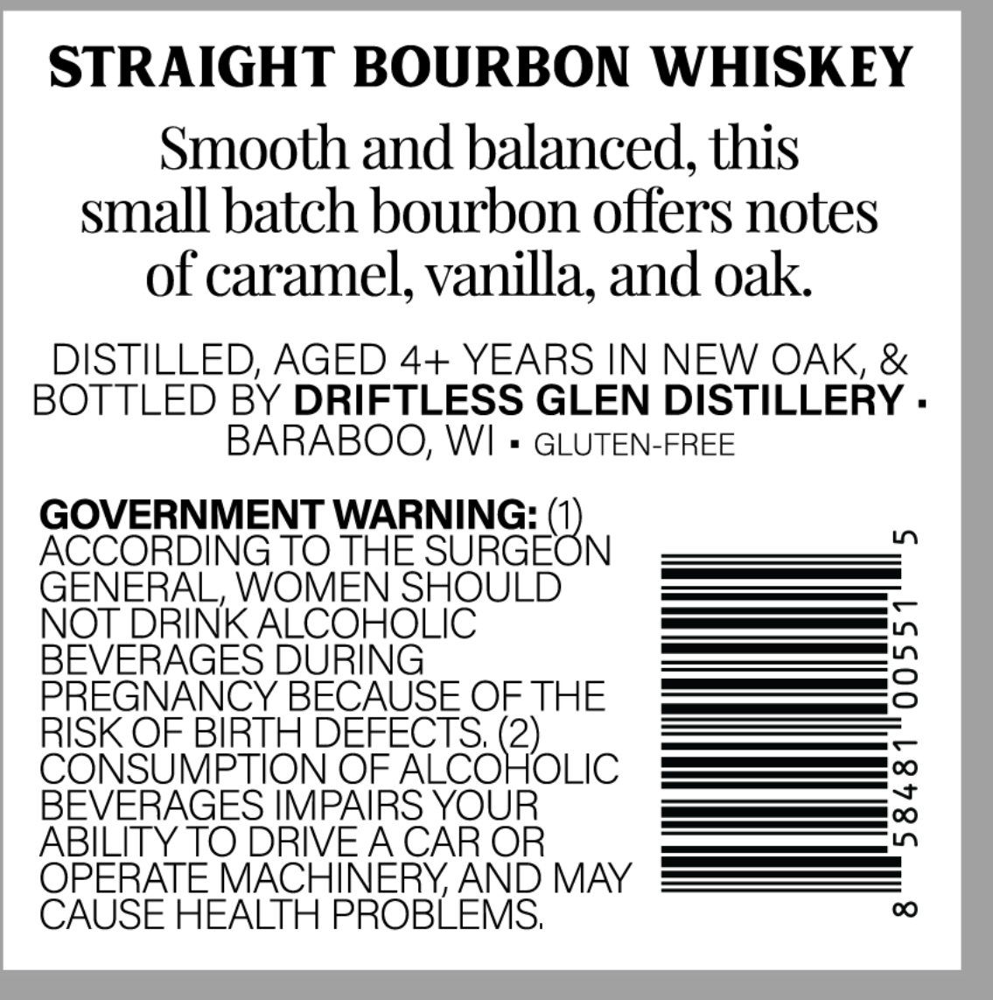
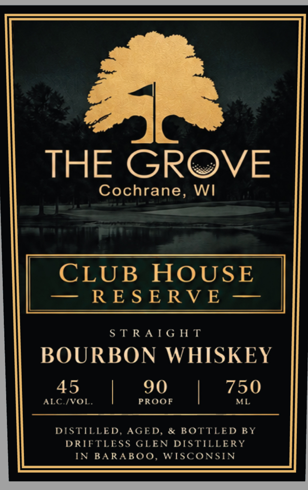

# TTB COLA Label Images - TTBID 26261001000210

**Brand Name:** THE GROVE

**Issue Date:** 09/18/2026

**Origin Code:** 48

**Product Class/Type:** 141

**Source:** [TTB Public COLA Registry](https://ttbonline.gov/colasonline/viewColaDetails.do?action=publicFormDisplay&ttbid=26261001000210)

## Label Images

### Back Label

### Front Label

## Extracted Label Text

*Text extracted via OCR - may contain errors*

### Back Label

STRAIGHT BOURBON WHISKEY
Smooth and balanced, this
small batch bourbon offers notes
of caramel, vanilla; and oak
DISTILLED, AGED 4+ YEARS IN NEW OAK, &
BOTTLED BY DRIFTLESS GLEN DISTILLERY .
BARABOO; WI
GLUTEN-FREE
GOVERNMENT WARNING:
L
ACCORDING TO THE SURGEON
GENERAL, WOMEN SHOULD
NOT DRINK ALCOHOLIC
BEVERAGES DURING
3
PREGNANCY BECAUSE OF THE
RISK OF BIRTH DEFECTS; (2)_
CONSUMPTION OF ALCOHOLIC
BEVERAGES IMPAIRS YOUR
1
ABILITY TO DRIVEA CAR OR
OPERATE MACHINERY AND MAY
CAUSE HEALTH PROBLEMS;
0

### Front Label

| CLUB HOUSE
— RESERVE —

STRAIGHT

BOURBON WHISKEY

45 90 750

ALC./VOL. | PROOF | ML

DISTILLED, AGED, & BOTTLED BY
DRIFTLESS GLEN DISTILLERY
IN BARABOO, WISCONSIN
