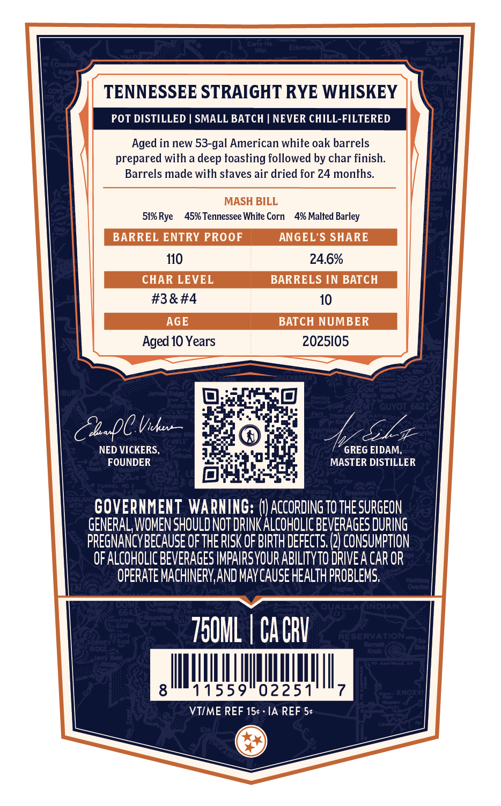
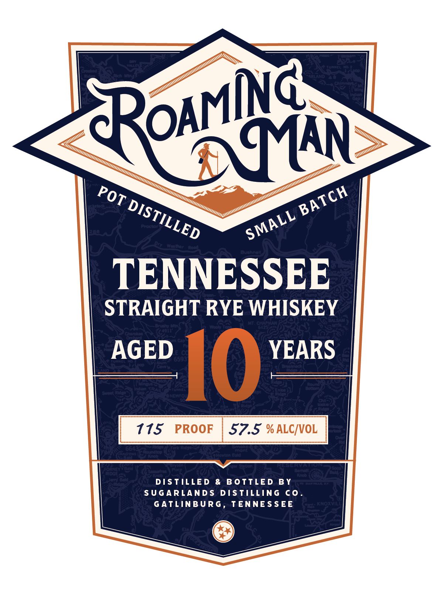

# TTB COLA Label Images - TTBID 26261001000233

**Brand Name:** ROAMING MAN

**Fanciful Name:** POT DISTILLED SMALL BATCH

**Issue Date:** 09/18/2026

**Origin Code:** 43

**Product Class/Type:** 102

**Source:** [TTB Public COLA Registry](https://ttbonline.gov/colasonline/viewColaDetails.do?action=publicFormDisplay&ttbid=26261001000233)

## Label Images

### Back Label

### Front Label

## Extracted Label Text

*Text extracted via OCR - may contain errors*

**Detected Proof:** 115
**Detected Age:** 10 Years

### Back Label

n

n
TENNESSEE STRAIGHT RYE WHISKEY
POT DISTILLED
SMALL BATCH
NEVER CHILL-FILTERED
Aged in new 53-gal American white oak barrels
prepared with a deep toasting followed by char finish:
Barrels made with staves air dried for 24 months
A
MASH BILL
51% Rye
45% Tennessee White Corn
4% Malted Barley
BARREL ENTRY PROOF
ANGEL'S SHARE
110
24.6%
CHAR LEVEL
BARRELS IN BATCH
#3&#4
10
AGE
BATCH NUMBER
Aged 10 Years
2025105
uas
GuvOT
ZbpC Vku
Sz
NED VICKERS,
GREG EIDAM;
FOUNDER
MASTER DISTILLER
2
GOVERHMEKT WARHING:
ACCORDING TO THE SURGEON
GENERAL, WOMEN SHOULD NOT DRINK ALcoHoLic BEVERAGES DURING
PREGNANCYBECAUSE OF THE RISK OF BIRTH DEFECTS; (2) CONSUMPTION
OF ALCOHOLIC BEVERAGES IMPAIRSYOUR ABILITYTO DRIVEA CAR OR
OPERATE MACHINERVAND MAYCAuSE HEALTH PROBLEMS

Bal
7501L
Ca CRV
FESFFAFOA
3
8
11559
02251
KNOM
VTIME REF 154
IA REF 54
I

### Front Label

Sa
MAN
TENNESSEE
STRAIGHT RYE WHISKEY
AGED
YEARS
I0
3
115
PROOF
57.5 % ALCMVOL
9o
2
1
tets
ad
#atertten Bald

DISTILLED
B 0TTLE D
B Y
SUGARLAND $
D[STILLING
co
GATLINBUR G , TENNE S SEE
CNOAMII
coAMNG
BATCH
Pot
DISTILLED
SMALL
