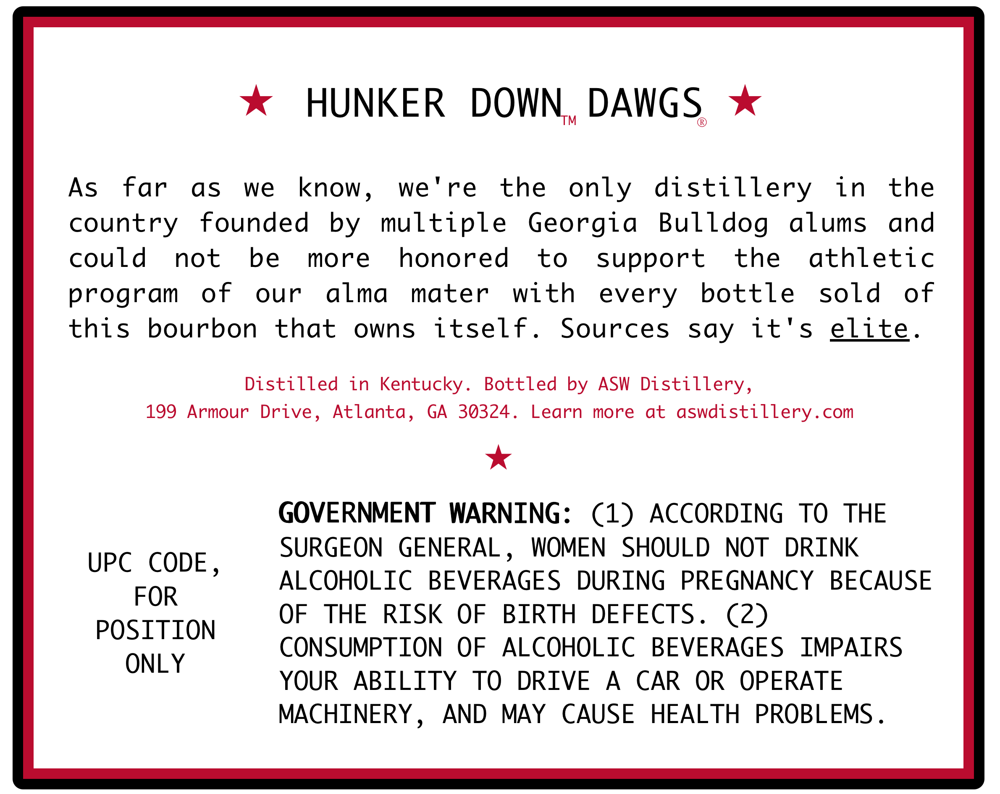
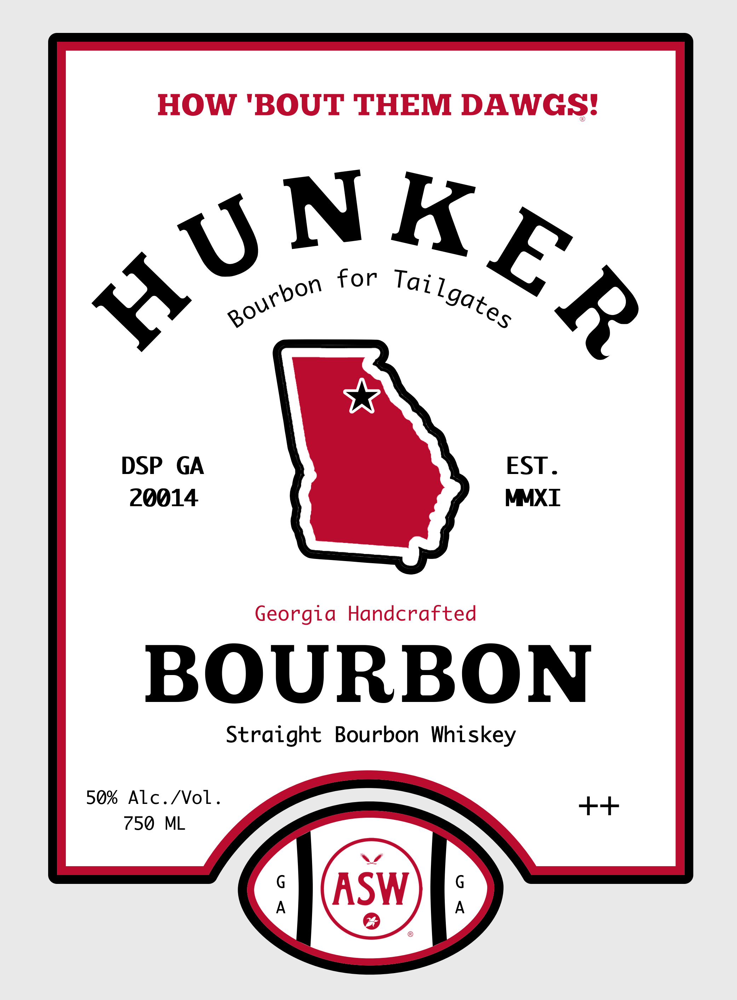

# TTB COLA Label Images - TTBID 26261001000249

**Brand Name:** HUNKER

**Issue Date:** 10/05/2026

**Origin Code:** 08

**Product Class/Type:** 101

**Source:** [TTB Public COLA Registry](https://ttbonline.gov/colasonline/viewColaDetails.do?action=publicFormDisplay&ttbid=26261001000249)

## Label Images

### Back Label

### Front Label

## Extracted Label Text

*Text extracted via OCR - may contain errors*

**Detected Proof:** 100

### Back Label

HUNKER
DOWN
DAWGS
TM
As
far
as
we
know
)
we ' re
the
only
distillery
in
the
country
founded
by
multiple
Georgia
Bulldog
alums
and
could
not
be
more
honored
to
support
the
athletic
program
of
our
alma
mater
with
every
bottle
sold
of
this
bourbon
that
owns
itself.
Sources
say
it' s
elite:
Distilled
in Kentucky_
Bottled
ASW Distillery,
199
Armour Drive, Atlanta,
GA
30324.
Learn
more
at
aswdistillery.com
GOVERNMENT  WARNING:
(1)
ACCORDING
To
THE
SURGEON
GENERAL
WOMEN
SHOULD
NOT
DRINK
UPC
CODE
9
ALCOHOLIC
BEVERAGES
DURING
PREGNANCY
BECAUSE
FOR
OF
THE
RISK
OF
BIRTH
DEFECTS .
(2)
POSITION
CONSUMPTION
OF
ALCOHOLIC
BEVERAGES
IMPAIRS
ONL Y
YOUR
ABILITY
TO
DRIVE
A
CAR
OR
OPERATE
MACHINERY
)
AND
MAY
CAUSE
HEALTH
PROBLEMS _
by

### Front Label

HOW 'BOUT THEM DAWGS?
for
DSP
GA
EST _
20014
MMXI
Georgia
Handcrafted
BOURBON
Straight
Bourbon Whiskey
50%
Alc./ol -
+
750
ML
G
G
ASW
A
A
3 NKER
5
Tai
Bourbon
Lgates
