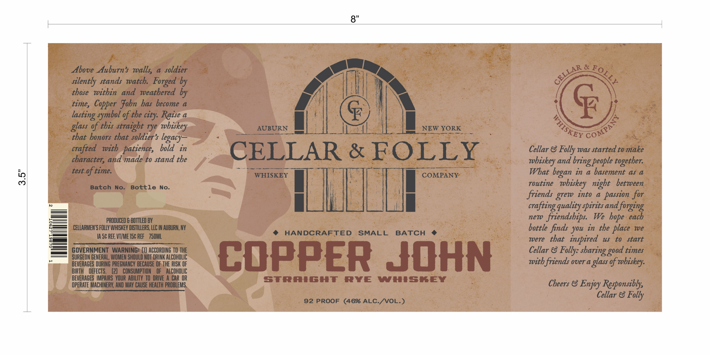

# TTB COLA Label Images - TTBID 26261001000270

**Brand Name:** CELLAR & FOLLY WHISKEY COMPANY

**Fanciful Name:** COPPER JOHN STRAIGHT RYE WHISKEY

**Issue Date:** 09/22/2026

**Origin Code:** 02

**Product Class/Type:** 102

**Source:** [TTB Public COLA Registry](https://ttbonline.gov/colasonline/viewColaDetails.do?action=publicFormDisplay&ttbid=26261001000270)

## Label Images

### Label 1

## Extracted Label Text

*Text extracted via OCR - may contain errors*

**Detected Proof:** 92

### Label 1

8"
Above Auburn?s walls;
a
soldier
&
silently stands watch Forged by
those   within and weathered by
time,  Copper  Fobn has become
a
F
%f the city: Raise a
F
glass %f this straight rye
AUBURN
NEW YORK
$
that honors that soldier $ legacy
crafted
with patience,
bold
in
CELLAR
FOLLY
Cellar 8 Folly was started to make
character; and made to stand the
and
people together:
test
of time.
WHISKEY
COMPANY
What
in a basement as a
63
Batch
No:
Bottle
No.
routine
night
between
friends grew into
a
passion for
quality-
and forging
PRODUCED & BOTTLED BV
new
friendships.
We
CELLARMEN S Folly WhISKEY DIsTILLERS; LLC IN AUBURN; NY
bottle finds you in the place we
IA 5c REF; VT/ME Isc REF
750ML
HANDCRAFTED
SMALL
BATCH
were
that   inspired
to
start
GOVERNMENT   WARNING: (IJ ACCORDING TO THE
Cellar & Folly:
times
BERERAGEGEHERYE PREGEASET RECAUSEUF THEFUSRUF
COPPER John
mith friends over a _
glass %f
BIRTH
DEFECTS.
(2]
CONSUMPTION
OF
ALCOHOLIC
BEVERAGES IMPAIRS  VOUR  ABILITV  TO  DRIVE
CAR OR
Strright
RYE
WIISREY
OPERATE MACHINERY, AND MAY CAUSE HEALTH PROBLEMS.
Cheers &
Enjoy Responsibly
Cellar &
Folly
92 PROOF
(4696 ALC-/VOL:)
CELLAR
EOLLY
symbol
lasting
WHISKEY'
mhiskey
COMPE
whiskey
bring)
began_
whiskey
crafting
spirits =
bope
each
Us
sharinge
good _
rhiskey:
