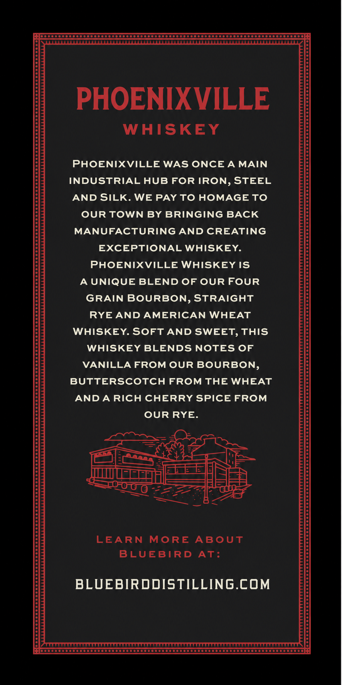
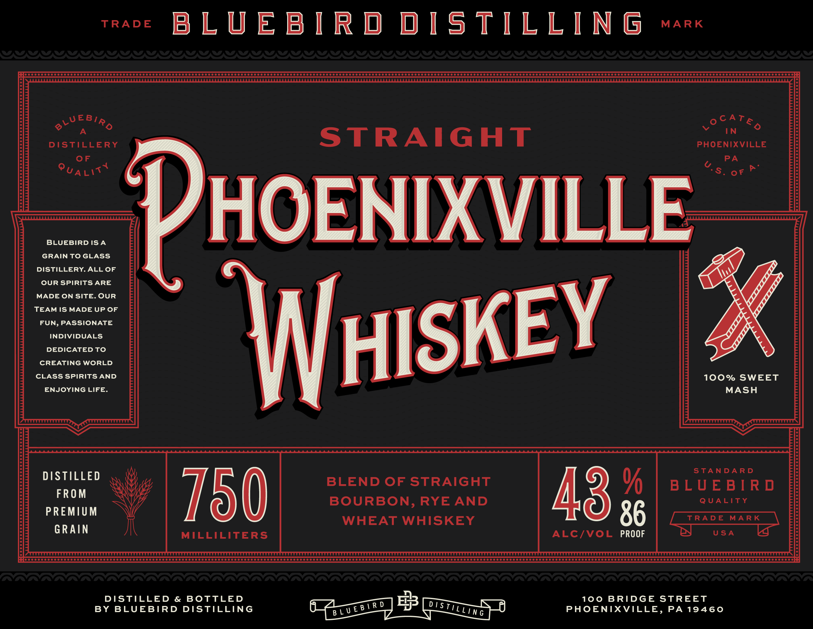
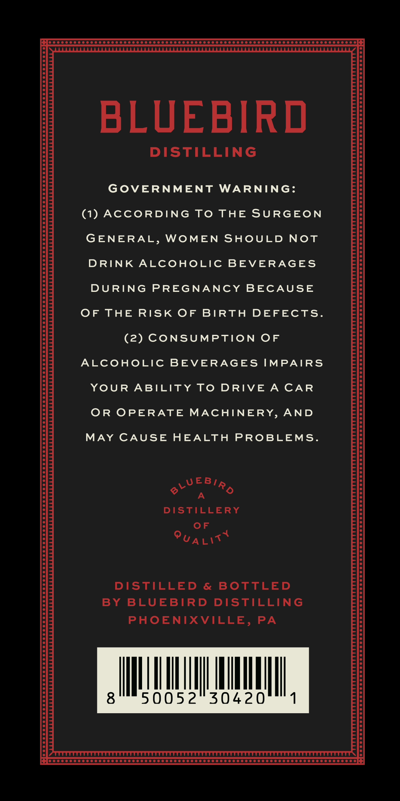

# TTB COLA Label Images - TTBID 26261001000282

**Brand Name:** BLUEBIRD DISTILLING

**Fanciful Name:** PHOENIXVILLE WHISKEY

**Issue Date:** 09/19/2026

**Origin Code:** 39

**Product Class/Type:** 129

**Source:** [TTB Public COLA Registry](https://ttbonline.gov/colasonline/viewColaDetails.do?action=publicFormDisplay&ttbid=26261001000282)

## Label Images

### Back Label

### Label 1

### Label 2

## Extracted Label Text

*Text extracted via OCR - may contain errors*

**Detected Proof:** 86

### Back Label

ooo

Seseeeee

PHOENIXVILLE

WHISKEY

PHOENIXVILLE WAS ONCE A MAIN

INDUSTRIAL HUB FOR IRON, STEEL

AND SILK. WE PAY TO HOMAGE TO

OUR TOWN BY BRINGING BACK

MANUFACTURING AND CREATING

EXCEPTIONAL WHISKEY.

PHOENIXVILLE WHISKEY IS

A UNIQUE BLEND OF OUR FOUR

GRAIN BOURBON, STRAIGHT

RYE AND AMERICAN WHEAT

WHISKEY. SOFT AND SWEET, THIS

WHISKEY BLENDS NOTES OF

VANILLA FROM OUR BOURBON,

BUTTERSCOTCH FROM THE WHEAT

AND A RICH CHERRY SPICE FROM

OUR RYE

za ©

7

OK

ees

AN

EEE]

= 2

siti MULT

=e

mes

pacacne le ——

che

=k

LEARN MORE ABOUT

BLUEBIRD AT

BLUEBIRDDISTILLING.COM

wecceeeccecocssescssccavecssccsscsseeccsseessesssseee poooooooooooor

### Label 1

MARK

eos BLUEBIRD DISTILLING

‘0 Gogo:

oCATe

2%

VWEBla

A

Vv

IN

STRAIGHT

DISTILLERY

PHOENIXVILLE

OF

PA

Pu, Lit

S. or?

BLUEBIRDISA

HOENIXVILL

GRAIN TO GLASS

DISTILLERY. ALL OF

OUR SPIRITS ARE

MADE ON SITE. OUR

TEAM IS MADE UP OF

FUN, PASSIONATE

INDIVIDUALS

DEDICATED TO

CREATING WORLD

CLASS SPIRITS AND

100% SWEET

ENJOYING LIFE

HISKE

MASH

STANDARD

DISTILLED

BLEND OF STRAIGHT

FROM

BLUEBIRD

BOURBON, RYE AND

QUALITY

PREMIUM

43%

WHEAT WHISKEY

GRAIN

MILLILITERS

ALC/VOL 86

TY

Ss

USA

ay

Le

CAAA LALLA L EEE NELLA ELLEN LEELA LEELA E LEELA ELLE E ELLEN LALLA ELLE LEELA LEELA LE LEELA ALLELE EEL E ELE L ALLELE EEL ALLELE EEE E LEELA ELE E ELE LALLA LEELA ELLE L LEELA ELE ELLE EEE LEELA LEELA LEE I ELLE E EEL EE LETTE EEE

DISTILLED & BOTTLED

100 BRIDGE STREET

BY BLUEBIRD DISTILLING

PHOENIXVILLE, PA 19460

### Label 2

POC CCC COCO OO OOOO SOC TOSCO SOTO SOOO OOOO OOOO TODO OO TOOT OOO TOD OOOOOOOOS

BLUEBIRD

DISTILLING

GOVERNMENT WARNING:

(1) ACCORDING TO THE SURGEON

GENERAL, WOMEN SHOULD NOT

DRINK ALCOHOLIC BEVERAGES

DURING PREGNANCY BECAUSE

OF THE RISK OF BIRTH DEFECTS.

(2) CONSUMPTION OF

ALCOHOLIC BEVERAGES IMPAIRS

YOUR ABILITY TO DRIVE A CAR

OR OPERATE MACHINERY, AND

MAY CAUSE HEALTH PROBLEMS.

WEBIa

DISTILLERY

OF

Puait

DISTILLED & BOTTLED

BY BLUEBIRD DISTILLING

PHOENIXVILLE, PA

ML

HII

A

50052

|

30420

ll,

PO COCO COCO OOOO OCOOOOCOOO OOOO OOOO OCOOO OOOO OOOO TOC OOO OOOO DODO DODO OOOO
