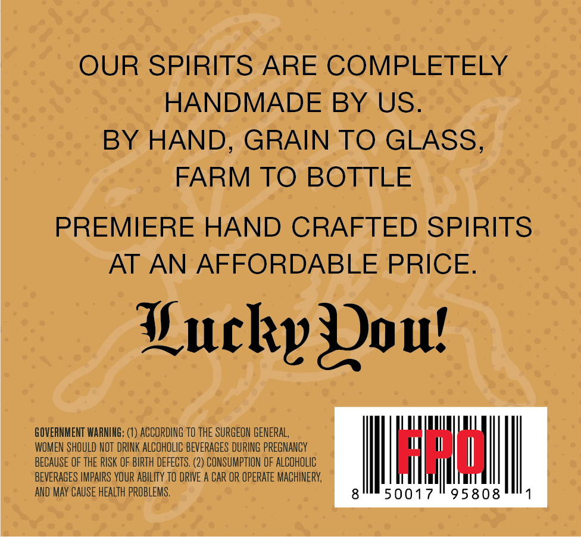
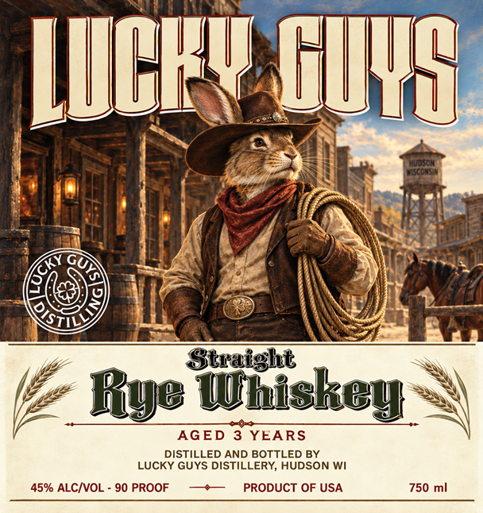

# TTB COLA Label Images - TTBID 26261001000370

**Brand Name:** LUCKY GUYS

**Issue Date:** 09/19/2026

**Origin Code:** 48

**Product Class/Type:** 102

**Source:** [TTB Public COLA Registry](https://ttbonline.gov/colasonline/viewColaDetails.do?action=publicFormDisplay&ttbid=26261001000370)

## Label Images

### Back Label

### Label 1

## Extracted Label Text

*Text extracted via OCR - may contain errors*

**Detected Proof:** 90
**Detected Age:** 3 Years

### Back Label

OUR SPIRITS ARE COMPLETELY
HANDMADE BY US.
BY HAND,
GRAIN TO GLASS,
FARM TO BOTTLE
PREMIERE HAND CRAFTED SPIRITS
AT AN AFFORDABLE PRICE.
Hucky Joul
GOVERNMENT WARNING:
ACCORDING to THE SURGEON GENERAL,
WOMEN SHOULD NOT  DRINK ALCOHOLIC BEVERAGES DURING PREGNANCY
BECAUSE OF THE RISK OF BIRTH DEFECTS ,
2) CONSUMPTION OF ALCOHOLIC
Hwd
BEVERAGES IMPAIRS YOUR aBIlITy to DRIVE A CAR OR OPERATE MACHINERY;
AND May CAUSE HEALTh PROBLEMS .
50017
95808

### Label 1

WLKV HUG
Mudsom
Kccont
Straight
Rye Umiskey
AGED
3 YEARS
DISTILLED AND BOTTLED BY
LUCKY GUYS DISTILLERY, HUDSON WI
45% ALCIVOL
90 PROOF
PRODUCT OF USA
750 ml
