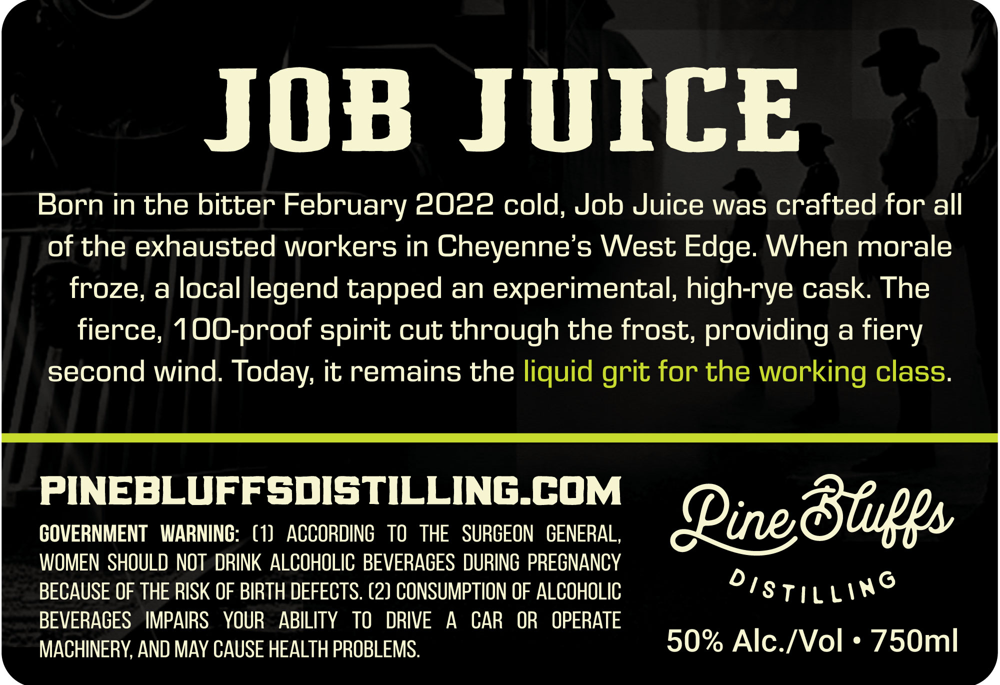
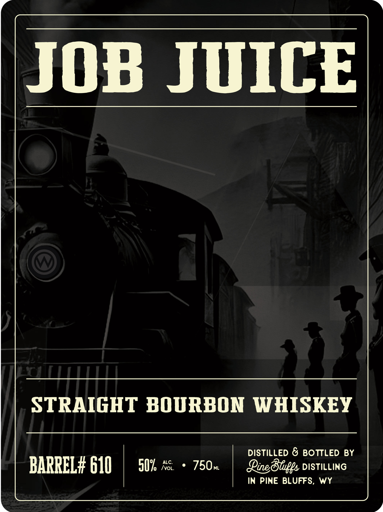

# TTB COLA Label Images - TTBID 26261001000409

**Brand Name:** PINE BLUFFS DISTILLING

**Fanciful Name:** JOB JUICE

**Issue Date:** 09/19/2026

**Origin Code:** 49

**Product Class/Type:** 101

**Source:** [TTB Public COLA Registry](https://ttbonline.gov/colasonline/viewColaDetails.do?action=publicFormDisplay&ttbid=26261001000409)

## Label Images

### Back Label

### Front Label

### Label 3

## Extracted Label Text

*Text extracted via OCR - may contain errors*

**Detected Proof:** 100

### Back Label

JOB JUICE

Born in the bitter February 2022 cold, Job Juice was crafted for all

of the exhausted workers in Cheyenne’s West Edge. When morale

froze, a local legend tapped an experimental, high-rye cask. The

fierce, 100-proof spirit cut through the frost, providing a fiery

second wind. Today, it remains the liquid grit for the working class.

PINEBLUFFSDISTILLING.COM

GOVERNMENT WARNING: (1) ACCORDING TO THE SURGEON GENERAL,

WOMEN SHOULD NOT DRINK ALCOHOLIC BEVERAGES DURING PREGNANCY

Line Bluffs

BECAUSE OF THE RISK OF BIRTH DEFECTS. (2) CONSUMPTION OF ALCOHOLIC

OI stiLLn®

BEVERAGES IMPAIRS YOUR ABILITY TO DRIVE A CAR OR OPERATE

MACHINERY, AND MAY CAUSE HEALTH PROBLEMS.

50% Alc./Vol * 750ml

### Front Label

JOB JUICE

STRAIGHT BOURBON WHISKEY

DISTILLED & BOTTLED BY

BARREL# 610 Oe

Line Bluffs DISTILLING

IN PINE BLUFFS, WY

### Label 3

WEST @) EDGE

Dine Bluffs

OTs TiLLWe
