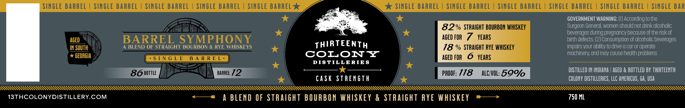

# TTB COLA Label Images - TTBID 26261001000509

**Brand Name:** THIRTEENTH COLONY DISTILLERIES

**Fanciful Name:** BARREL SYMPHONY SINGLE BARREL

**Issue Date:** 10/05/2026

**Origin Code:** 08

**Product Class/Type:** 129

**Source:** [TTB Public COLA Registry](https://ttbonline.gov/colasonline/viewColaDetails.do?action=publicFormDisplay&ttbid=26261001000509)

## Label Images

### Label 1

### Label 2

## Extracted Label Text

*Text extracted via OCR - may contain errors*

**Detected Proof:** 144
**Detected Age:** 7 Years

### Label 1

SINGLE BARREL
SINGLE BARREL
SINGLe BARREL
SINGLe BARREL
SINGLE BARREL
SINGLE BARREL
SINGLE BARREL
SINGLE BARREL
SINGLE BARREL
SINGLE BARREL
SINGLE BAR
GOVERNMENT WARNING: (I) According to the
82% STRAIGHT BOURBON WHISKEY
Surgeon General; women shouldnot drink dlcoholic
beverages during pregnancy because of the risk of
AGED
BARREL SYMPHONY
AGEd FOR
7
YEARS
birth defects (2) Consumption of dlcoholic beverages
IN SOUTH
A BLEND OF STRAIGHT BOURBON & RYE WHISKEYS
THIRTEENTH
18 % STRAIGHT RYE WHISKEY
impdirs your ability to drive a car or operate
GEORGIA
COLONY
machinery; und may cause hedlth problems:
S [ N G L E
B A R R E L .
AgED FOR
6
YEARS
DIS TILLE RIE S
86B0TTLE
BARREL 72
PROOF: 718
ALCHVOL: 59%
DISTILLED IN INDIANA | AGED & BOTTLED BY THIRTEENTH
cask STRENGTH
COLONY dIStILLERIES , LLC AMERICUS , GA, USA
13THCOLONYDISTILLERYCOM
A BLEND OF STRAGHT BOURBON WHISKEY & STRAIGHT RYE WHISKEY
750 ML

### Label 2

PSS SSS SSS SSS SSS SSS SSS SSS

THIRTEENTH

% STRAIGHT BOURBON % c

OLON YZ

STRAIGHT RYE

*

STILLERIE

ALAA LLL LLL LL LL LM hhh hh hh hh hh hhh hh hhh hhh hhh hhh hb hh hh hhh hhh hhh hh hhh hh hh hhh hhh hhh hh hh hh hh hhh hhh hh hhh hhh hhh hh hhh hhh hhh hh hh hh ht
