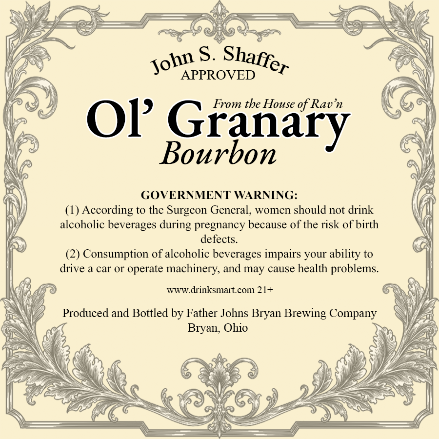
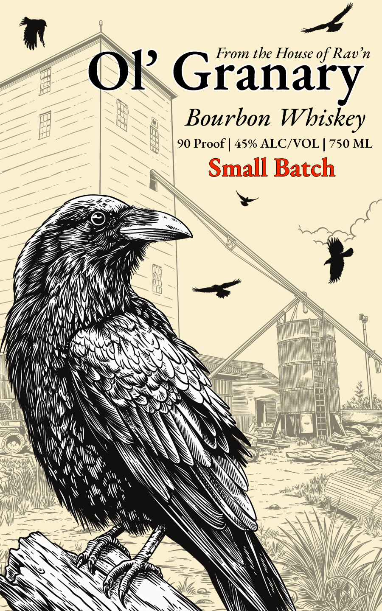

# TTB COLA Label Images - TTBID 26261001000523

**Brand Name:** OL' GRANARY

**Issue Date:** 09/21/2026

**Origin Code:** 09

**Product Class/Type:** 141

**Source:** [TTB Public COLA Registry](https://ttbonline.gov/colasonline/viewColaDetails.do?action=publicFormDisplay&ttbid=26261001000523)

## Label Images

### Back Label

### Front Label

## Extracted Label Text

*Text extracted via OCR - may contain errors*

*1 image(s) excluded: text did not meet readability threshold*

### Back Label

S.
APPROVED
tbe
of Ravn
OP Granary
Bourbon
GOVERNMENT WARNING:
(1) According to the Surgeon General, women should not drink
alcoholic beverages
pregnancy because of the risk of birth
defects.
(2) Consumption of alcoholic beverages impairs your ability to
drive a car or
operate machinery, and may cause health problems.
WWW.drinksmart com 21+
Produced and Bottled by Father Jolns Bryan Brewing Company
Bryan, Ohio
Shaffer
John
House
during
