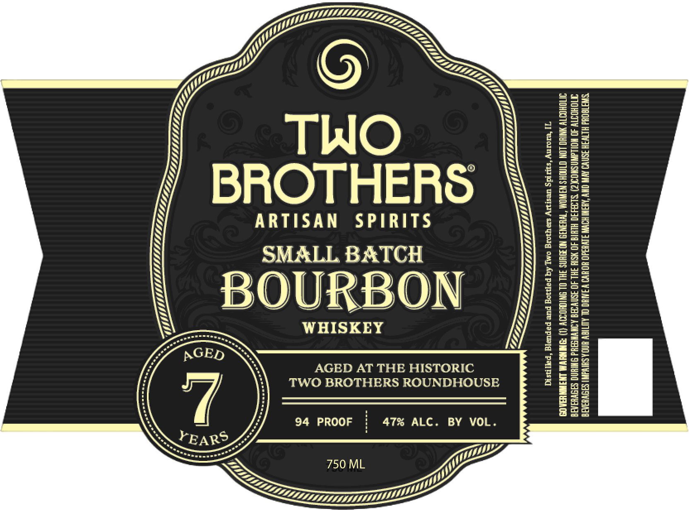

# TTB COLA Label Images - TTBID 26261001000660

**Brand Name:** TWO BROTHERS ARTISAN SPIRITS

**Fanciful Name:** 7 YEAR SMALL BATCH BOURBON

**Issue Date:** 09/24/2026

**Origin Code:** 04

**Product Class/Type:** 101

**Source:** [TTB Public COLA Registry](https://ttbonline.gov/colasonline/viewColaDetails.do?action=publicFormDisplay&ttbid=26261001000660)

## Label Images

### Label 1

## Extracted Label Text

*Text extracted via OCR - may contain errors*

**Detected Proof:** 94

### Label 1

‘SWATOOHd HLTH JSNVO AV OY “ASW SOV HSdO HOH WINHO OL AUTIGY AIA SHV SPS WHA
TVOHOTTY 40 NOLAN SHON) SLA4I0 WLI 40 HSI IHL 40 ASNWAD ANWWSAYd SMW SISWHS A
UIDHOOTY HNTHO LON OTNOHS NAWOMA *TWHSNIS NOUNS 3H. OL SNICKOSOY (1) SN LS EEA 08)

VI] omny ‘sds Westy se qorg omy Aq papiog pure papustg ‘paynsiT

S

AGED AT THE HISTORIC
TWO BROTHERS ROUNDHOUSE
47% ALC. BY VOL.

WHISKEY

94 PROOF

:
”
aa)
=
=
Ww

Ww
=
c
a
wi
=
=
wv
—
c
=

oc
Li
:
e)
oc
a)

—
=
—
=
=
=
=
=)
=
—
—

<<< ZT LLL
LIF,
