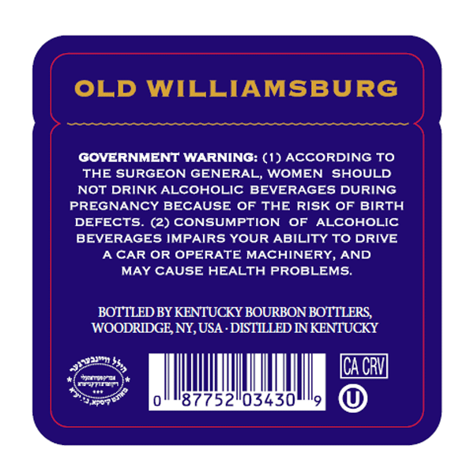
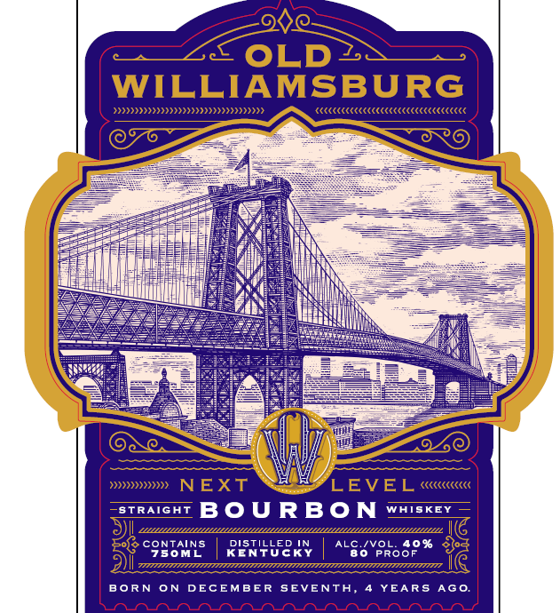

# TTB COLA Label Images - TTBID 26261001000666

**Brand Name:** OLD WILLIAMSBURG

**Issue Date:** 09/19/2026

**Origin Code:** 02

**Product Class/Type:** 101

**Source:** [TTB Public COLA Registry](https://ttbonline.gov/colasonline/viewColaDetails.do?action=publicFormDisplay&ttbid=26261001000666)

## Label Images

### Back Label

### Front Label

### Label 3

## Extracted Label Text

*Text extracted via OCR - may contain errors*

*1 image(s) excluded: text did not meet readability threshold*

### Back Label

OLD WILLIAMSBURG
GOVERNMENT WARNING: (1) ACCORDING TO
THE SURGEON GENERAL, WOMEN SHOULD
NOT DRINK ALCOHOLIC BEVERAGES DURING
PREGNANCY BECAUSE OF THE RISK OF BIRTH
DEFECTS
(2) CONSUMPTION
OF
ALCOHOLIC
BEVERAGES IMPAIRS YOUR ABILITY TO DRIVE
A CAR OR OPERATE MACHINERY,
AND
MAY CAUSE HEALTH PROBLEMS:
BOTTLED BY KENTUCKY BOURBON BOTTLERS
WOODRIDGE NY; USA . DISTILED NNKENTUCKY
ICA CRV
'87752103430'

### Front Label

OLD
WILLIAMSBURG
Diiii}
{((((((((((((((((((((((((((((((((((
484
)))))=
NEXT
LEVEL
((((((((((((
STRATGHT
BoURBON
WAISKEY
D1
LLLL
CONTAINS
Ris#uek
ALC
6 VoRo8o%
7s0ML
80
Tiani
BoRN
ON
DECEMBER
SEVENTA,
YEARS Ago.
