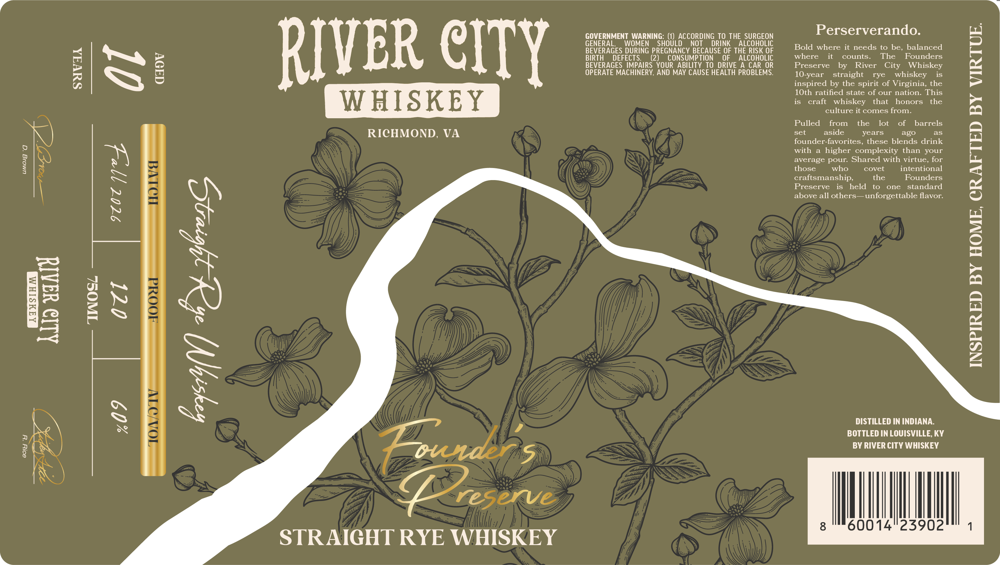

# TTB COLA Label Images - TTBID 26262001000122

**Brand Name:** RIVER CITY WHISKEY

**Issue Date:** 09/22/2026

**Origin Code:** 22

**Product Class/Type:** 102

**Source:** [TTB Public COLA Registry](https://ttbonline.gov/colasonline/viewColaDetails.do?action=publicFormDisplay&ttbid=26262001000122)

## Label Images

### Label 1

### Label 2

## Extracted Label Text

*Text extracted via OCR - may contain errors*

*1 image(s) excluded: text did not meet readability threshold*

### Label 1

umolg ‘q

80lY “UY

Allo waAld

SUVAA

PY) LHS

VER CITY

WHISKEY

RICHMOND, VA

STRAIGHT RYE WHISKEY

GOVERNMENT WARNING: (1) ACCORDING TO THE SURGEON
GENERAL, WOMEN SHOULD NOT DRINK ALCOHOLIC
BEVERAGES DURING PREGNANCY BECAUSE OF THE RISK OF
BIRTH DEFECTS. (2) CONSUMPTION OF ALCOHOLIC
BEVERAGES IMPAIRS YOUR ABILITY TO DRIVE A CAR OR
OPERATE MACHINERY, AND MAY CAUSE HEALTH PROBLEMS.

Perserverando.

Bold where it needs to be, balanced
where it counts. The Founders
Preserve by River City Whiskey
10-year straight rye whiskey is
inspired by the spirit of Virginia, the
10th ratified state of our nation. This
is craft whiskey that honors the
culture it comes from.

Pulled from the lot of barrels
set aside years EYexe) as
founder-favorites, these blends drink
with a higher complexity than your
average pour. Shared with virtue, for
those who covet intentional
craftsmanship, the Founders
Preserve is held to one standard
above all others— unforgettable flavor.

DISTILLED IN INDIANA.

BOTTLED IN LOUISVILLE, KY

BY RIVER CITY WHISKEY

8°" 60014°23902

4

INSPIRED BY HOME, CRAFTED BY VIRTUE.
