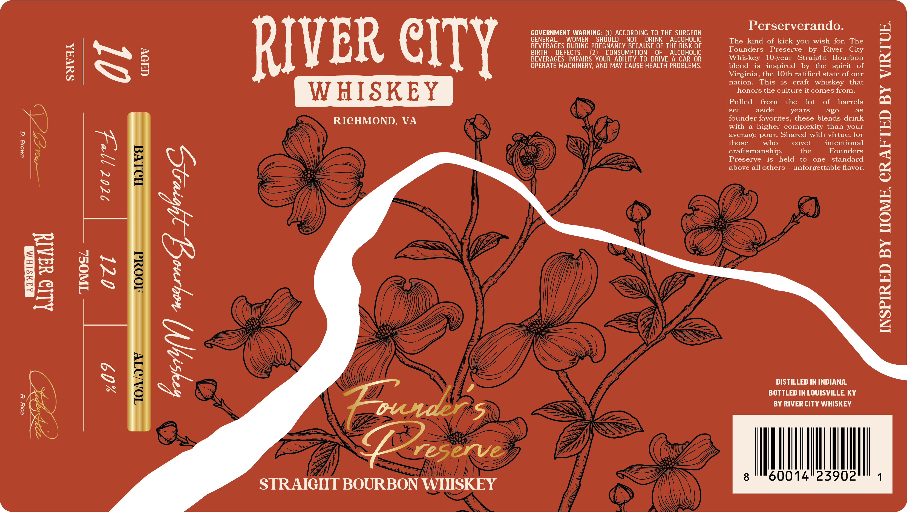

# TTB COLA Label Images - TTBID 26262001000123

**Brand Name:** RIVER CITY WHISKEY

**Issue Date:** 09/22/2026

**Origin Code:** 22

**Product Class/Type:** 101

**Source:** [TTB Public COLA Registry](https://ttbonline.gov/colasonline/viewColaDetails.do?action=publicFormDisplay&ttbid=26262001000123)

## Label Images

### Label 1

### Label 2

## Extracted Label Text

*Text extracted via OCR - may contain errors*

*1 image(s) excluded: text did not meet readability threshold*

### Label 1

Perserverando.
GOVERNMENT  WARNING: (1) ACCORDING TO THE SURGEON
GENERAL,
WOMEN
SHOULD
NOT
DRINK
ALCOHOLIC
The kind of kick you wish for:
The
RIVER CITY
BTRTERAGDEF
Qefouring PREGCONSY BGoUsE %F THEcoFolE
Founders
Preserve
by
River
E
Is8
BEVERAGES IMPAIRS YOUR ABILITY TO DRIVE
A CAR OR
Whiskey   10-year
Straight
Bourbon
OPERATE MACHINERY; AND MAY CAUSE HEALTH PROBLEMS__
blend
is
inspired
by
the
spirit
of
Virginia, the IOth ratified state of
our
nation.
This
is
craft
whiskey
that
WHISKEY
honors the culture it comes from.
6
Pulled
from
the
lot
of
barrels
set
aside
years
ago
as
RICHMOND,
VA
founder-favorites, these blends drink
with
higher   complexity than
your
0
average pour: Shared with virtue, for
choftsmanship,
cotlee
inteutioeal
0
0
2
1
Pbeseraie othehe
held_nforgectable
one
bste fiduod
4
13
7
1
6
1
del
13
1
1
4
DISTILLED IN INDIANA
BOTTLED IN LOUISVILLE, KY
3
BY RIVER CITY WHISKEY
reserve
8
60014"23902
STRAIGHT BOURBON WHISKEY
City
3
8
Mouwdr
