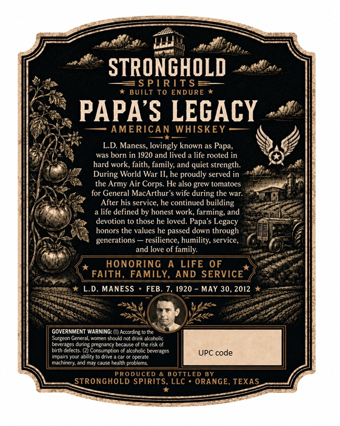
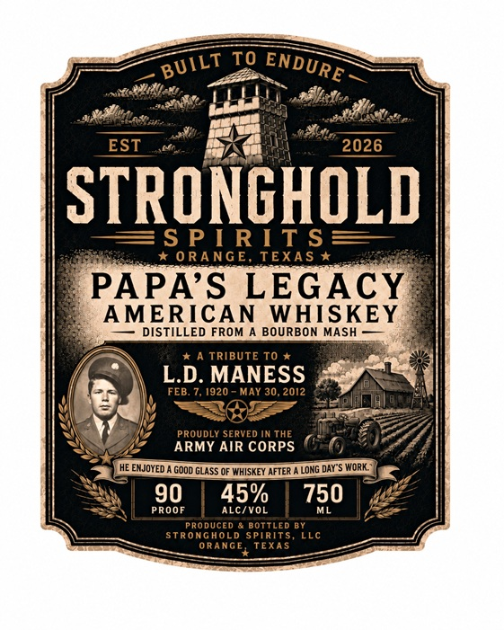

# TTB COLA Label Images - TTBID 26263001000057

**Brand Name:** STRONGHOLD SPIRITS

**Fanciful Name:** PAPA'S LEGACY AMERICAN WHISKEY

**Issue Date:** 09/21/2026

**Origin Code:** 44

**Product Class/Type:** 140

**Source:** [TTB Public COLA Registry](https://ttbonline.gov/colasonline/viewColaDetails.do?action=publicFormDisplay&ttbid=26263001000057)

## Label Images

### Back Label

### Front Label

## Extracted Label Text

*Text extracted via OCR - may contain errors*

**Detected Proof:** 90

### Back Label

STRONGHOLD
S PI RIT$
BUILT
To ENDURE
PAPAS LEGACY
AMERICAN WHISKEY
LD Maness, lovingly known as Papa,
born in 1920 and lived
life rooted in
hard work, faith,
family; and
strength:
During World War II, he proudly served in
the Army Air Corps. He also grew tomatoes
for General MacArthur
wife during the war
After his service; he continued building
life defined by honest work, farming; and
devotion to those he loved: Papa $ Legacy
honors the values he passed down through
generations
resilience, humility; service,
and love of amily:
HONORING
A LIFE 0F
FAITH, FAMILY, AND SERVICE
L.D_
MANESS
FEB
1920
MaY 30,2012
GOVERNMENT WARNING: (I) Accordee t0 Inc
Seton (Grrenl Komcn cheuld ctdakakctalc
brvcrazc
Icrnange
Hdns-
Thaant
bintheecs
Consumotion
alcotch Lavcrares
Imdains Konahit
Oneale
UPC code
MachinetandMJ cause iedml Orcdicmy
DUCED
B OTTLED BY
STRONGHOLD SPIRITS,
LLC
ORANGE, TEXAS
quiet

### Front Label

TO
EST
2026
STRONCHOLD
S P [ RIT $
0 RANGE, TEXA S
PAPAS LEGAcy
AMERICAN
WHISKEY
DISTILLED FROM
BOURBON MASH
TRIBUTE TO
LD: MANESS
FEB.
1920
May 30.2012
PRoUdLY SEPVED IN THE
ARMY AIR CORPS
HE EMJOYed
Gdod GLaSS QF WHISKEY AFTER
LonG daY"S WORK
90
45%
750
PROOF
ALc/vol
pRO ducrm
BOTTLEd BY
StronGhold SpiRiTS
LLc
ORANGE
TEXAS
BUILT
ENDURE
