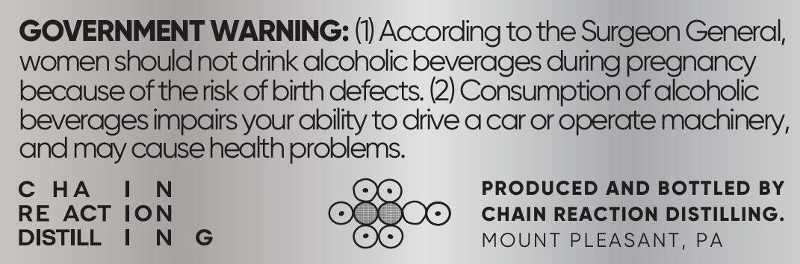
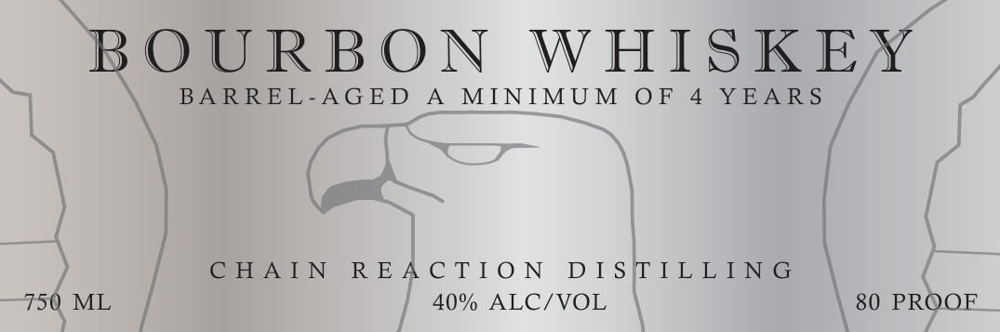

# TTB COLA Label Images - TTBID 26264001000001

**Brand Name:** CHAIN REACTION DISTILLING

**Issue Date:** 09/23/2026

**Origin Code:** 39

**Product Class/Type:** 141

**Source:** [TTB Public COLA Registry](https://ttbonline.gov/colasonline/viewColaDetails.do?action=publicFormDisplay&ttbid=26264001000001)

## Label Images

### Back Label

### Front Label

## Extracted Label Text

*Text extracted via OCR - may contain errors*

**Detected Proof:** 80
**Detected Age:** 4 Years

### Back Label

GOVERNMENT WARNING: (1) According to the Surgeon General

women should not drink alcoholic beverages during pregnancy

because of the risk of birth defects. (2) Consumption of alcoholic

beverages impairs your ability to drive a car or operate machinery,

and may cause health _..

C HA

I

N

PRODUCED AND BOTTLED BY

RE ACT ION

SOO CHAIN REACTION DISTILLING.

DISTILL |

N G

MOUNT PLEASANT, PA

### Front Label

BOURBON WHISKEY

BARREL-AGED A MINIMUM OF 4 YEARS

CHAIN REACTION DISITILLING

750 ML

40% ALC/VOL

80 PRQOF
