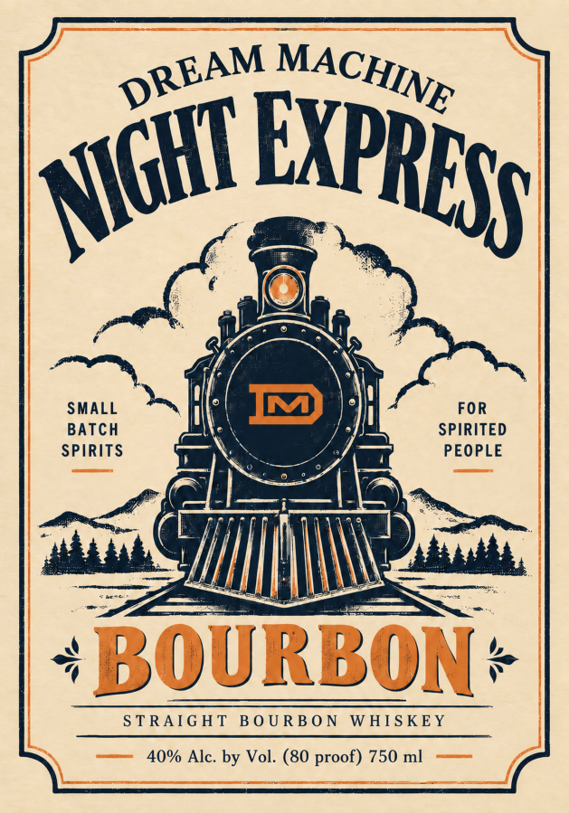
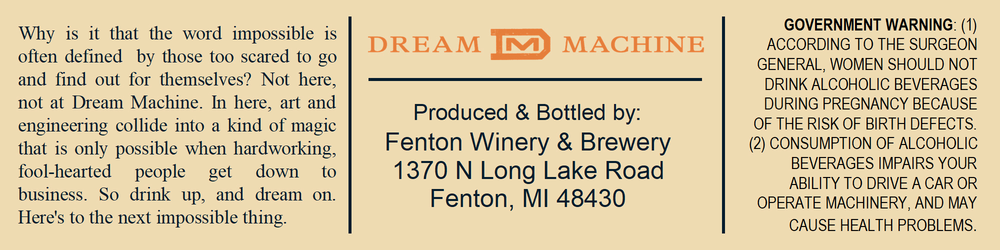

# TTB COLA Label Images - TTBID 26264001000014

**Brand Name:** DREAM MACHINE

**Fanciful Name:** NIGHT EXPRESS

**Issue Date:** 09/23/2026

**Origin Code:** 06

**Product Class/Type:** 101

**Source:** [TTB Public COLA Registry](https://ttbonline.gov/colasonline/viewColaDetails.do?action=publicFormDisplay&ttbid=26264001000014)

## Label Images

### Label 1

### Label 2

## Extracted Label Text

*Text extracted via OCR - may contain errors*

**Detected Proof:** 80

### Label 1

SMALL
FOR
BaTch
SPIRITED
SPIRITS
PEOPLE
BOURBON
S TRAG HT
B 0 U RB 0 N
WHIS KEY
40% Alc: by Vol: (80 proof) 750 ml
MACHINE
DREAM
EXPRESS
NIGHI ,

### Label 2

GOVERNMENT WARNING:
Why is it that
the
word   impossible is
DREAM
C
MACHINE
ACCORDING TO THE SURGEON
often defined
by those too scared to go
GENERAL, WOMEN SHOULD NOT
and find
out for themselves?
Not here;
DRINK ALCOHOLIC BEVERAGES
not at Dream Machine.
In here, art and
DURING PREGNANCY BECAUSE
Produced & Bottled by:
engineering collide into
a
kind of magic
OF THE RISK OF BIRTH DEFECTS:
that is only possible when hardworking,
Fenton Winery & Brewery
(2) CONSUMPTION OF ALCOHOLIC
fool-hearted
people
down
to
1370 N Long Lake Road
BEVERAGES IMPAIRS YOUR
ABILITY TO DRIVE A CAR OR
business.
So
drink
up,
and
dream
on:
Fenton; MI 48430
OPERATE MACHINERY, AND MAY
Here's to the next
impossible
CAUSE HEALTH PROBLEMS:
get
thing
