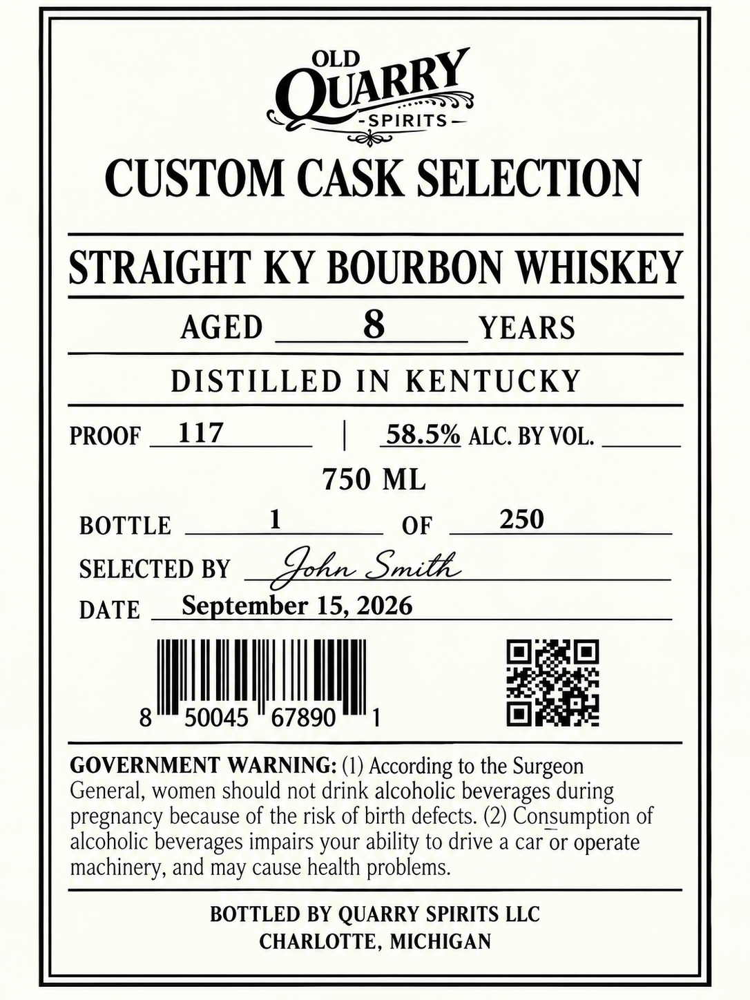

# TTB COLA Label Images - TTBID 26264001000016

**Brand Name:** OLD QUARRY SPIRITS

**Fanciful Name:** CUSTOM CASK SELECTION

**Issue Date:** 10/05/2026

**Origin Code:** 06

**Product Class/Type:** 101

**Source:** [TTB Public COLA Registry](https://ttbonline.gov/colasonline/viewColaDetails.do?action=publicFormDisplay&ttbid=26264001000016)

## Label Images

### Label 1

## Extracted Label Text

*Text extracted via OCR - may contain errors*

**Detected Proof:** 117
**Detected Age:** 8 Years

### Label 1

OLD
SPIRITS
CUSTOM CASK SELECTION
STRAIGHT KY BOURBON WHISKEY
AGED
8
YEARS
DISTILLED IN
KENTUCKY
PROOF
117
58.5% ALC BY VOL.
750 ML
BOTTLE
OF
250
SELECTED BY
Ihn_Snith
DATE
September 15,2026
8
50045
67890
GOVERNMENT WARNING: (1)
According to the Surgeon_
General, women should not drink alcoholic beverages during
pregnancy because of the risk of birth defects (2) Consumption of
alcoholic beverages impairs your ability to drive a car or operate
machinery, and may cause health problems.
BOTTLED BY QUARRY SPIRITS LLC
CHARLOTTE, MICHIGAN
QUARRY
