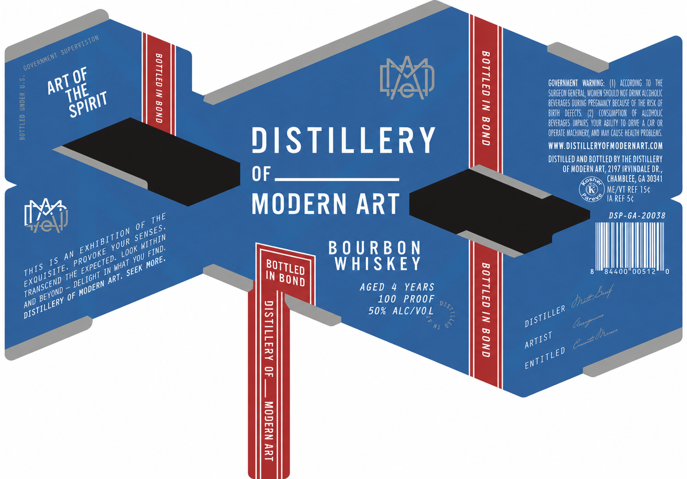

# TTB COLA Label Images - TTBID 26264001000059

**Brand Name:** DISTILLERY OF MODERN ART

**Issue Date:** 09/24/2026

**Origin Code:** 08

**Product Class/Type:** 111

**Source:** [TTB Public COLA Registry](https://ttbonline.gov/colasonline/viewColaDetails.do?action=publicFormDisplay&ttbid=26264001000059)

## Label Images

### Label 1

## Extracted Label Text

*Text extracted via OCR - may contain errors*

**Detected Proof:** 100

### Label 1

3
OF
8
1
GOVERHMEHT   Marhihg:
ACCOrdIng   T0   The
{
SURGEOH GENERAL, VOHEH SHOULD HOT DRIHK ALcOHOUc
8
<
BEVERAGES DURIHG preghcy BECause OF THE RISK Of
3
BIRTH   DEFECTS.
COHSUMPTOK   Of   alcoholc
BEVEragEs  IPAIRS YOUR ABIUIY T0  DRIE A Car Or
1
3
Operate MachIeRy; AVD HAY CAUSE HEALTH PROBLEHS.
DISTILLERY
WWW.distilleryofModernart.com
DIStILLED AND bottled BY the distillery
OF MODErn art, 2197 IrvIndale dR ,
OF
CHAMBLEE; Ga 30341
MEYVT REF ISc
Ore
IA REF Sc
MODERN ART
DSP-Ga-20038
0F
An
B 0 U R B 0 N
I5
W HISKEY
In
84400"00512
IN
AGED
YEARS
1
AND
OF
100
PROOF
50% ALC/VO L
3
1
3
9
1
4
~SUPERVISION
'GOVERIIMENT
ART
THE
SPIRIT
THE
SENSES.
BITION
WITHIN
YOUR
EXHIE
LoOK
FIND:
PROVOKE
YOU
EXPECTED.
MORE:
' WHAT
BOTTLED
THIS
EXQUISITE.
SEEK _
THE
DELIGHT_
ART:
BOND
TRANSCEND
MODERN
dhE
BEYOND _
DISTILLERY
0IS7,
DISTILLER
Gazdhuen
ARTIST
ENTITLED
