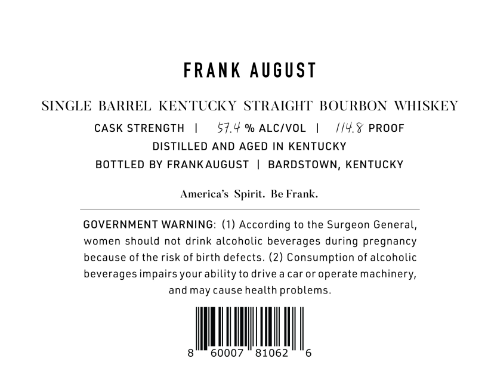
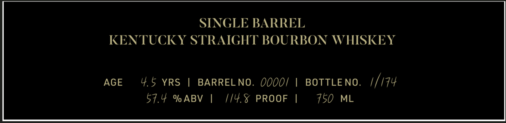

# TTB COLA Label Images - TTBID 26264001000093

**Brand Name:** FRANK AUGUST

**Fanciful Name:** SINGLE BARREL KENTUCKY STRAIGHT BOURBON WHISKEY

**Issue Date:** 09/21/2026

**Origin Code:** 22

**Product Class/Type:** 101

**Source:** [TTB Public COLA Registry](https://ttbonline.gov/colasonline/viewColaDetails.do?action=publicFormDisplay&ttbid=26264001000093)

## Label Images

### Front Label

### Label 2

## Extracted Label Text

*Text extracted via OCR - may contain errors*

**Detected Proof:** 114.8
**Detected Age:** 4.5 Years

### Front Label

FRAnK August
SINGLE BARREL KENTUCKY
STRAICHT' BOURBON
WHISKEY
CASK STRENGTH
57.4 % ALCIVOL
0/4.X PROOF
DISTILLED AND AGED IN KENTUCKY
BOTTLED BY FRANKAUGUST
BARDSTOWN, KENTUCKY
America s Spirit.
Ke Frank
GOVERNMENT WARNING: (1) According to the Surgeon General,
women should not drink alcoholic beverages
pregnancy
because of the risk of birth defects. (2) Consumption of alcoholic
beverages impairs your ability to drive a caror operate machinery,
and may cause health problems_
60007
81062
during

### Label 2

SINGLE BARREL
KENTUCKY STRAIGHT BOURBON WHISKEY
AGE
4.5
YRS
BARREL NO.
0oo0i
BOTTLE NO.
1/174
57.40 % ABV
1/4.X
PROOF
750
ML
