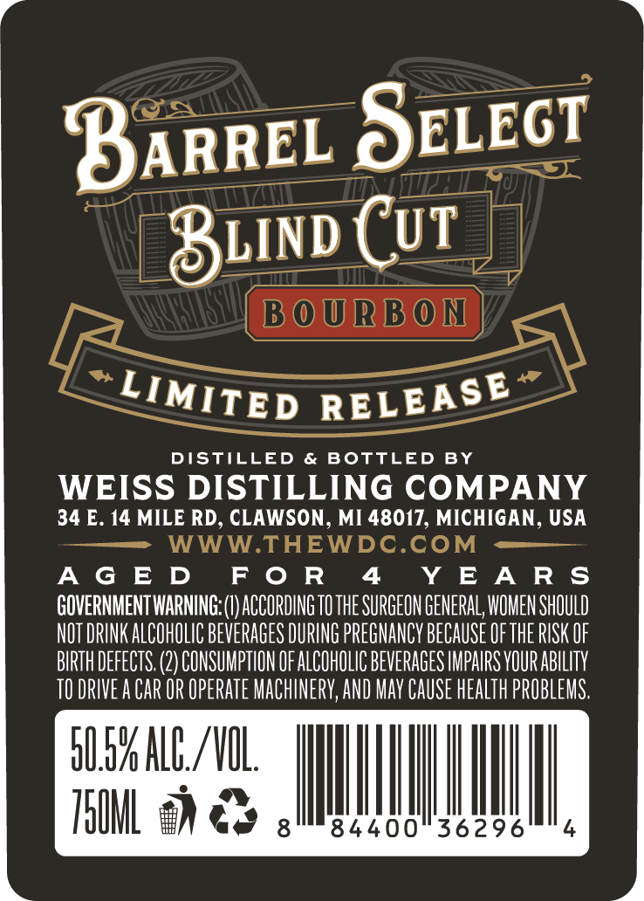
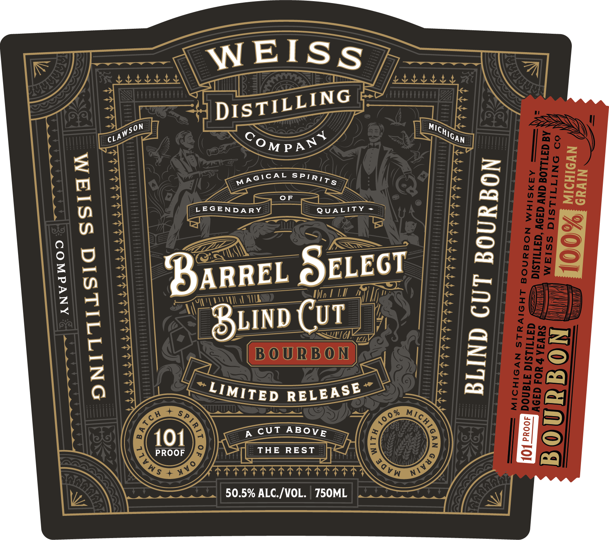

# TTB COLA Label Images - TTBID 26264001000194

**Brand Name:** BARREL SELECT BLIND CUT BOURBON

**Issue Date:** 10/06/2026

**Origin Code:** 06

**Product Class/Type:** 101

**Source:** [TTB Public COLA Registry](https://ttbonline.gov/colasonline/viewColaDetails.do?action=publicFormDisplay&ttbid=26264001000194)

## Label Images

### Back Label

### Front Label

### Label 2

### Label 3

### Label 4

## Extracted Label Text

*Text extracted via OCR - may contain errors*

*1 image(s) excluded: text did not meet readability threshold*

**Detected Proof:** 101
**Detected Age:** 4 Years

### Back Label

BARREL SELECT

Biinp CUT

“LIMITED RELEASE”

DISTILLED & BOTTLED BY
WEISS DISTILLING COMPANY
34 E. 14 MILE RD, CLAWSON, MI 48017, MICHIGAN, USA
WWW.THEWDC.COM

AGED FOR 4 YEARS
GOVERNMENTWARNING: (I) ACCORDING TO THE SURGEON GENERAL, WOMEN SHOULD
NOT DRINK ALCOHOLIC BEVERAGES DURING PREGNANCY BECAUSE OF THE RISK OF
BIRTH DEFECTS. (2) CONSUMPTION OF ALCOHOLIC BEVERAGES IMPAIRS YOUR ABILITY
TO DRIVEA CAR OR OPERATE MACHINERY, AND MAY CAUSE HEALTH PROBLEMS.

O05 ALC VOL MI

HOM ES

8440

### Front Label

WEISS
8
1
LEGENDARY
0F
QUALITY
1
8

8
88
8
9
BARREL SELEGT
Hl
1
F
8LIND Cut
E|
6
B O URB O N
1
Iz
H
ch
Sp
3
101
THE
REST
E
1
PROOF
Ws + m
77777
50.5% ALC /VOL.
750ML
DISTILLING
Wson
MICHICAN
OM PAN +
CLAI
1
MAGCAL
SPIRTTS
LIMITED
RELEASE
MIC E
2
1
A CUT
ABoVE
NIV49
GVW

### Label 2

TITT TTT TTT TT TTT ttt ttt TT TT TTT TT TTT TT TT TTT TT TT TT TT TT TT
YYYYYYYYYYYYYYYYYYYYYYYYYYYYYYYYYYYYYYYYYYYYYYYYYYYYYYYYYYYYYYYYYYYYYYYYYY

SLIUYUIdS ALITVNO LSAHDIH AHL

AIDA I IIIS III IIA I IDI III III II III III III III III III III I III III III III III III III IIIA
ttt ttt rttttritrretrterrtertsreriteretrretrrtrtritrterrtirriteritrrererrtretet

### Label 3

DISTILLED
AND
B OTTLED
IN
CLAWSON,
MICHIGA N
BARREL SELECT
WEISS
ESTB.
DISTILLING
BOURBON
2020
COMPANY
W HIS KEY
PRODUct
0 F
ThE
UNITED
STATES
0 F
AMERIC A
