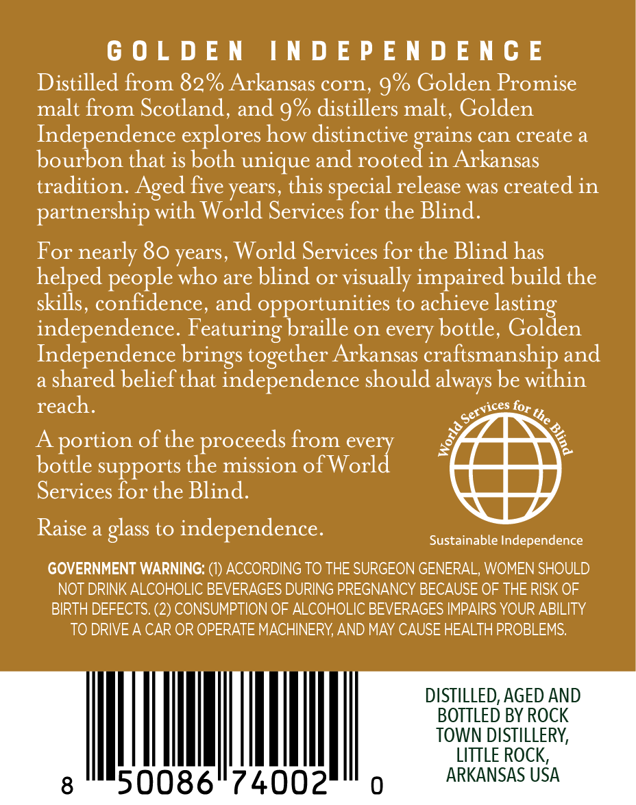
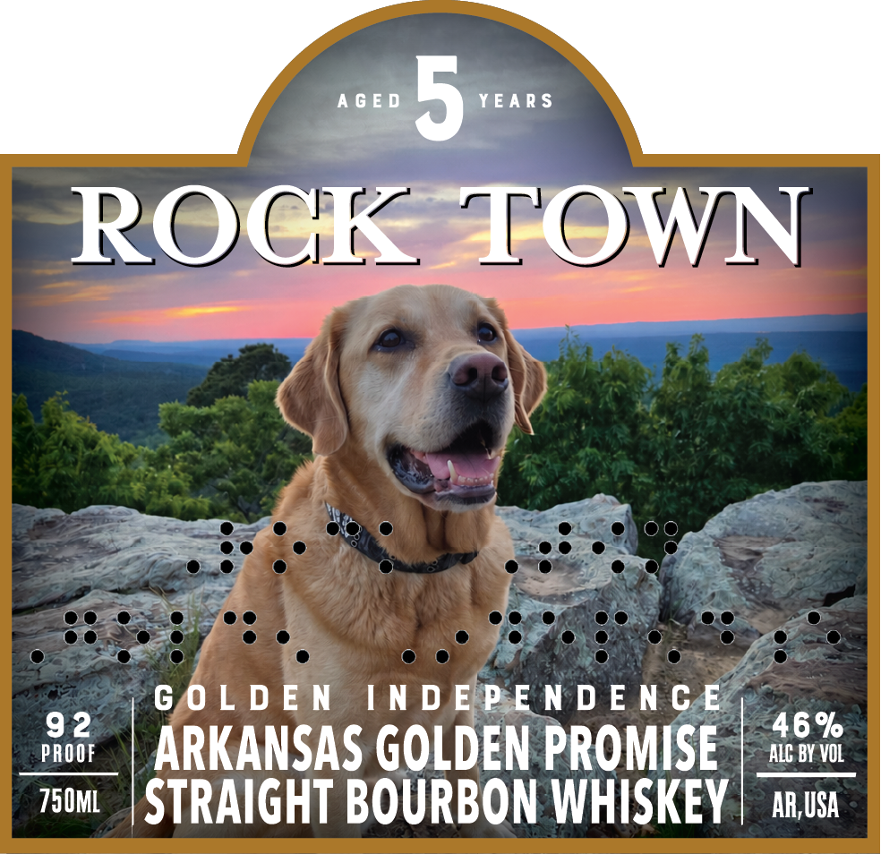

# TTB COLA Label Images - TTBID 26264001000283

**Brand Name:** ROCK TOWN

**Fanciful Name:** GOLDEN INDEPENDENCE

**Issue Date:** 09/23/2026

**Origin Code:** 12

**Product Class/Type:** 101

**Source:** [TTB Public COLA Registry](https://ttbonline.gov/colasonline/viewColaDetails.do?action=publicFormDisplay&ttbid=26264001000283)

## Label Images

### Back Label

### Front Label

## Extracted Label Text

*Text extracted via OCR - may contain errors*

### Back Label

GOLDEN INDEPENDENCE

Distilled from 82% Arkansas corn, 9% Golden Promise
malt from Scotland, and 9% distillers malt, Golden
Independence explores how distinctive grains can create a
bourbon that is both unique and rooted in Arkansas
tradition. Aged five years, this special release was created in

partnership with World Services for the Blind.

For nearly 80 years, World Services for the Blind has
helped people who are blind or visually impaired build the
skills, confidence, and opportunities to achieve lasting
independence. Featuring braille on every bottle, Golden
Independence brings together Arkansas craftsmanship and
a shared belief that independence should always be within

reach. a for %,
A portion of the proceeds from every J 3,
bottle supports the mission of Worl

Services for the Blind.

Raise a glass to independence. sustsinable independence
GOVERNMENT WARNING: (1) ACCORDING TO THE SURGEON GENERAL, WOMEN SHOULD
NOT DRINK ALCOHOLIC BEVERAGES DURING PREGNANCY BECAUSE OF THE RISK OF
BIRTH DEFECTS. (2) CONSUMPTION OF ALCOHOLIC BEVERAGES IMPAIRS YOUR ABILITY
TO DRIVE A CAR OR OPERATE MACHINERY, AND MAY CAUSE HEALTH PROBLEMS.

DISTILLED, AGED AND
BOTTLED BY ROCK
TOWN DISTILLERY,

LITTLE ROCK,
ARKANSAS USA

### Front Label

>

ROG A-OWN

Ky

eae

a

ay

GOLDEN INDEPEN DENGE,

bs

ARKANSAS GOLDEN PROMISE

ALG BY VOL

73m | STRAIGHT BOURBON WHISKEY

AR,USA
