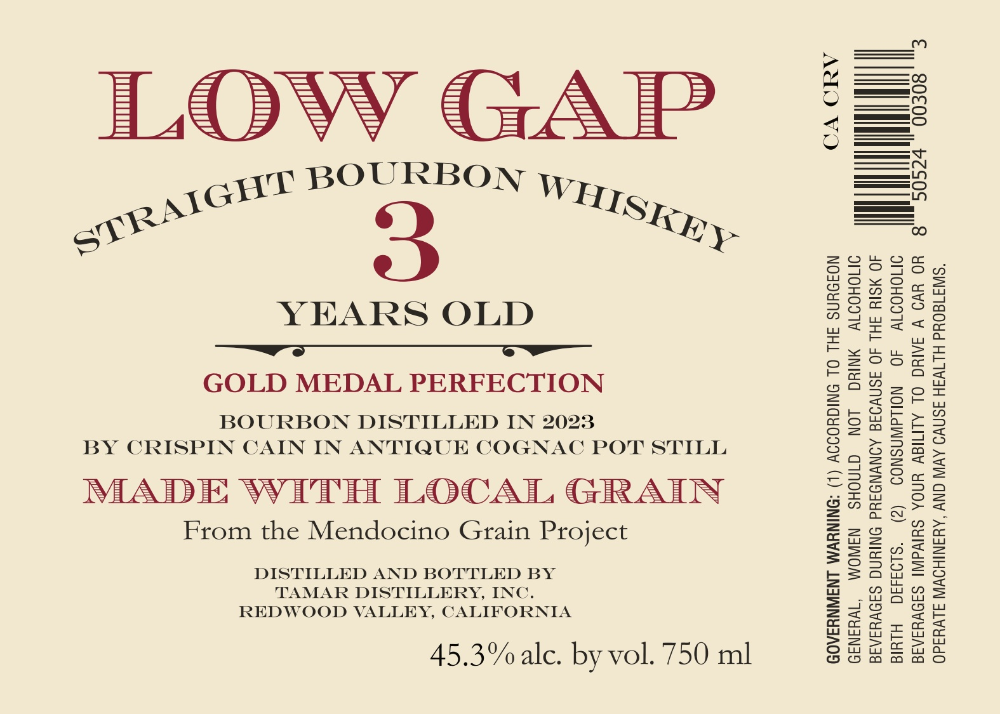
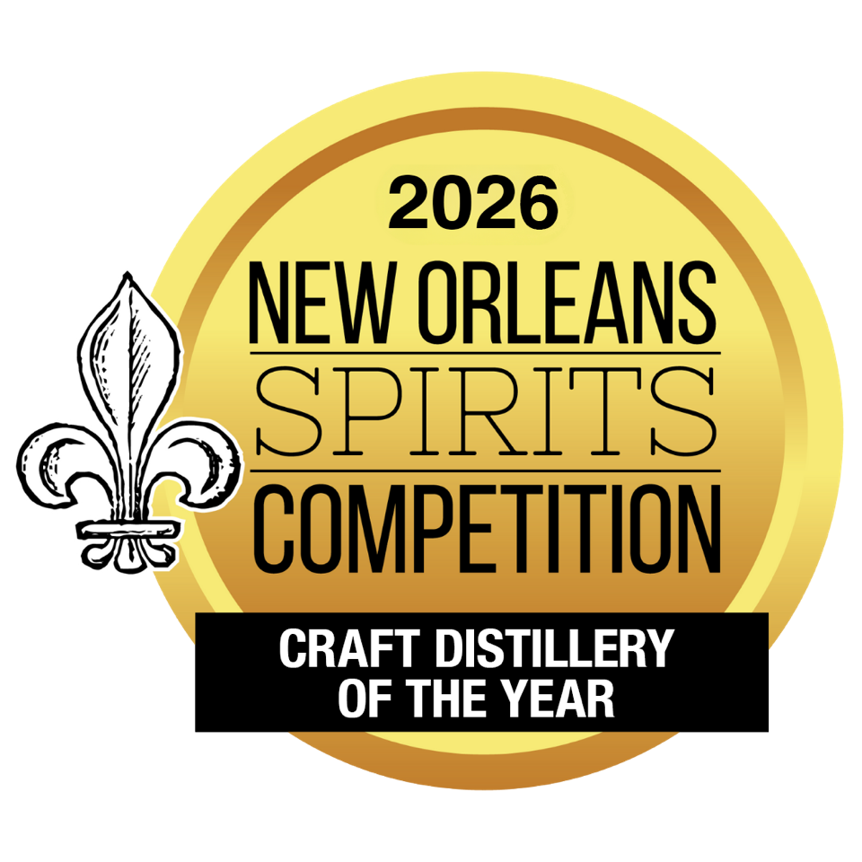

# TTB COLA Label Images - TTBID 26264001000332

**Brand Name:** LOW GAP

**Fanciful Name:** GOLD MEDAL PERFECTION

**Issue Date:** 09/23/2026

**Origin Code:** 01

**Product Class/Type:** 101

**Source:** [TTB Public COLA Registry](https://ttbonline.gov/colasonline/viewColaDetails.do?action=publicFormDisplay&ttbid=26264001000332)

## Label Images

### Label 1

### Label 2

## Extracted Label Text

*Text extracted via OCR - may contain errors*

**Detected Proof:** 90.6

### Label 1

ILOvyY GAP

BOURBON
jGHT WED;
gone “Rey.

YEARS OLD

GOLD MEDAL PERFECTION

BOURBON DISTILLED IN 2023
BY CRISPIN CAIN IN ANTIQUE COGNAC POT STILL

E WITH LOCAL GRAIN

From the Mendocino Grain Project

DISTILLED AND BOTTLED BY
TAMAR DISTILLERY, INC.
REDWOOD VALLEY, CALIFORNIA

45.3% alc. by vol. 750 ml

00308

CA CRV

! 50524

CONSUMPTION OF ALCOHOLIC

(2)

WOMEN SHOULD NOT DRINK ALCOHOLIC

BEVERAGES DURING PREGNANCY BECAUSE OF THE RISK OF

BIRTH DEFECTS.
BEVERAGES IMPAIRS YOUR ABILITY TO DRIVE A CAR OR 8
OPERATE MACHINERY, AND MAY CAUSE HEALTH PROBLEMS.

GOVERNMENT WARNING: (1) ACCORDING TO THE SURGEON

GENERAL,

### Label 2

2026
NEW ORLEANS
SPIRITS
COMPETITION
CRAFT DISTILLERY
OF THE YEAR
