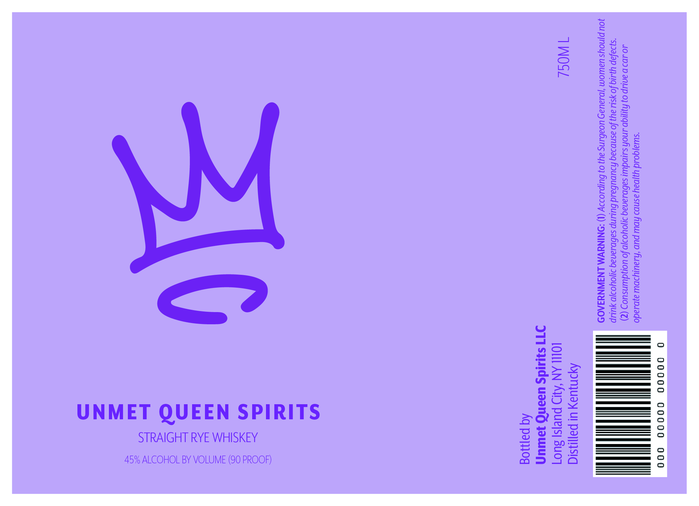

# TTB COLA Label Images - TTBID 26264001000378

**Brand Name:** UNMET QUEEN SPIRITS

**Issue Date:** 09/23/2026

**Origin Code:** 02

**Product Class/Type:** 102

**Source:** [TTB Public COLA Registry](https://ttbonline.gov/colasonline/viewColaDetails.do?action=publicFormDisplay&ttbid=26264001000378)

## Label Images

### Label 1

## Extracted Label Text

*Text extracted via OCR - may contain errors*

**Detected Proof:** 90

### Label 1

0 a0000 00000 O00

“sula}qo.d Y}]Day asnb2 Apw pun ‘Aiauiy2DW ajb1ado
40.109 D antup 07 Aygo tnoh suipduu sabpsanag ajoyoo}p fo uoyjduinsuo5 (

N
~S

“syoafap yj.tig fo ysil ay} fo asnp2aq haupubaud buiinp sabp.anag d1}0Yyoo}p yulup
JOU pjnoys uawiom j.auay Uoab.ins ay} 0} burp1099y (1) :NINYWM LNAIWNUJAOD

Apnuay ul payjasia

om LOL AN ‘Alp puejs] 3u07
ITI Siuids useNnG yawuy

Aq pajog

STRAIGHT RYE WHISKEY
45% ALCOHOL BY VOLUME (90 PROOF)

UNMET QUEEN SPIRITS
