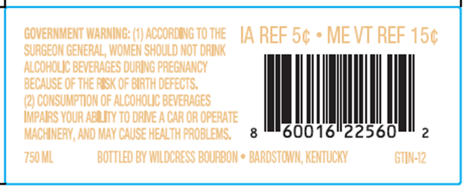
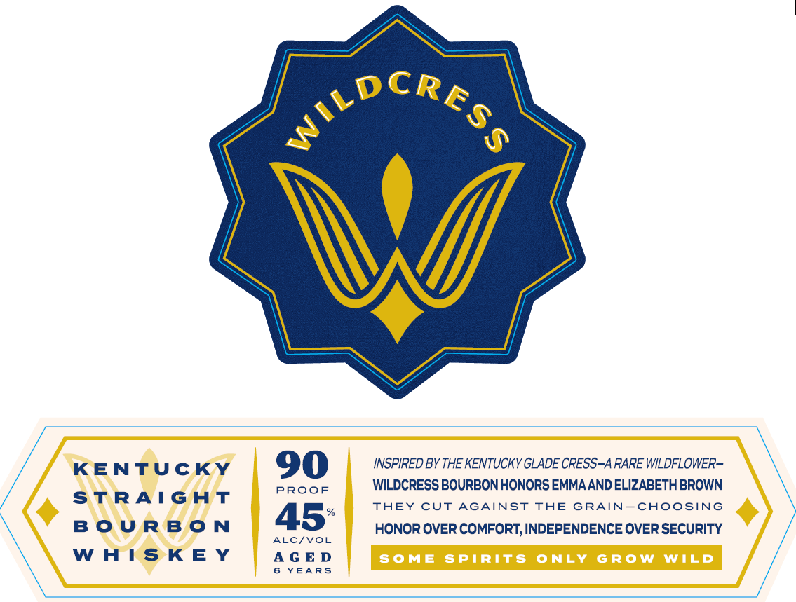

# TTB COLA Label Images - TTBID 26264001000385

**Brand Name:** WILDCRESS

**Issue Date:** 09/23/2026

**Origin Code:** 22

**Product Class/Type:** 101

**Source:** [TTB Public COLA Registry](https://ttbonline.gov/colasonline/viewColaDetails.do?action=publicFormDisplay&ttbid=26264001000385)

## Label Images

### Back Label

### Label 1

### Label 2

## Extracted Label Text

*Text extracted via OCR - may contain errors*

*1 image(s) excluded: text did not meet readability threshold*

**Detected Age:** 6 Years

### Back Label

GOVERNMENT WARNING: (1) ACCORDING TOTHE [A REF 5¢ * MEVT REF 15¢
SURGEON GENERAL, WOMEN SHOULD NOT DRINK

ALCOHOLIC BEVERAGES DURING PREGNANCY
BECAUSE OF THE RESK OF BIRTH DEFECTS.
8

(2) CONSUMPTION OF ALCOHOLIC BEVERAGES
IMPAIRS YOUR ABRLITY TO DRIVE A CAR OR OPERATE
MACHINERY, AND MAY CAUSE HEALTH PROBLEMS, 60016"22560

750 ML BOTTLED BY WILDCRESS BOURBON * BARDSTOWN, KENTUCKY GTIN-12

### Label 1

KENTUCKY

INSPIRED BY THE KENTUCKY GLADE CRESS-A RARE WILDFLOWER-

90

STRAIGHT

PROOF

WILDCRESS BOURBON HONORS EMMA AND ELIZABETH BROWN

THEY CUT AGAINST THE GRAIN—CHOOSING

45°

BOURBON

ALC/VOL

HONOR OVER COMFORT, INDEPENDENCE OVER SECURITY

WHISKEY

AGED

6 YEARS
