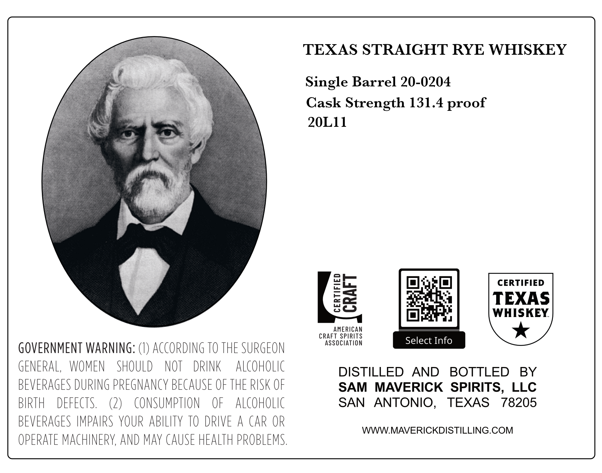
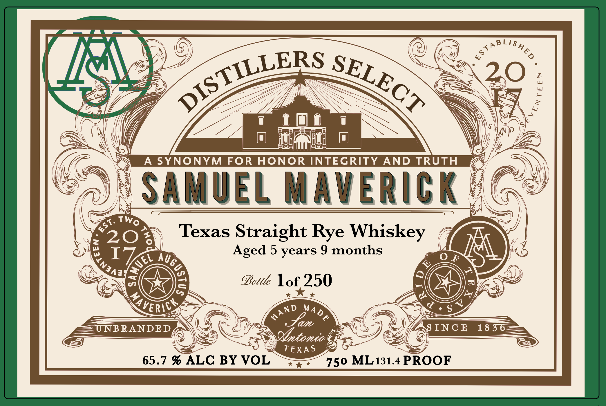

# TTB COLA Label Images - TTBID 26264001000388

**Brand Name:** SAMUEL MAVERICK

**Fanciful Name:** DISTILLERS SELECT

**Issue Date:** 09/24/2026

**Origin Code:** 44

**Product Class/Type:** 102

**Source:** [TTB Public COLA Registry](https://ttbonline.gov/colasonline/viewColaDetails.do?action=publicFormDisplay&ttbid=26264001000388)

## Label Images

### Back Label

### Front Label

## Extracted Label Text

*Text extracted via OCR - may contain errors*

**Detected Proof:** 131.4
**Detected Age:** 5 Years

### Back Label

TEXAS STRAIGHT RYE WHISKEY
Single Barrel 20-0204
Cask Strength 131.4 proof
20LI1
CERTIFIED
03
TEXAS
WHISKEY
AMERICAN
CRAFT SPIRITS
AssOciATiON
Select Info
GOVERNMENT WARNING:
ACcORDING TO THE SURGEON
GENERAL,
WOMEN
SHOULD
NOT
DRINK
Alcoholic
DISTILLED
AND
BOTTLED
BY
BEVERAGES DURING PREGNANCY BECAUSE OF THE RISK OF
SAM
MAVERICK   SPIRITS, LLC
BIRTH
DEFECTS.
(2)
CONSUMpthon
OF
ALCOHOLIC
SAN
ANTONIO,
TEXAS
78205
BEVERAGES IMPAIRS YOUR ABILiTY TO DRIVE
A CAR OR
WWWMAVERICKDISTILLING.COM
OPERATE MACHINERY, AND maY CAUSE HEALTH PROBLEMS

### Front Label

AB
X
5
k
20
A SYNONYM
FOR
HONOR INTEGRITY
AND TRUTH
SAMUEL MaveriCK
&
20
2
Texas Straight Rye Whiskey
I
Aged 5 years 9 months
0
F
~
2
E
Bottle Iof 250
2
A
7 , S`
X
UNB RANDED
Jan
S INC @
18 36
Obtonio
TEXA S
65.7 % ALC BY VOL
750 ML131.4 PROOF
LishED
DISTILLERS
SELECT
1
Two
St:
8
(
Augc
Ec
7
#
VERICK
MAD&
AND
