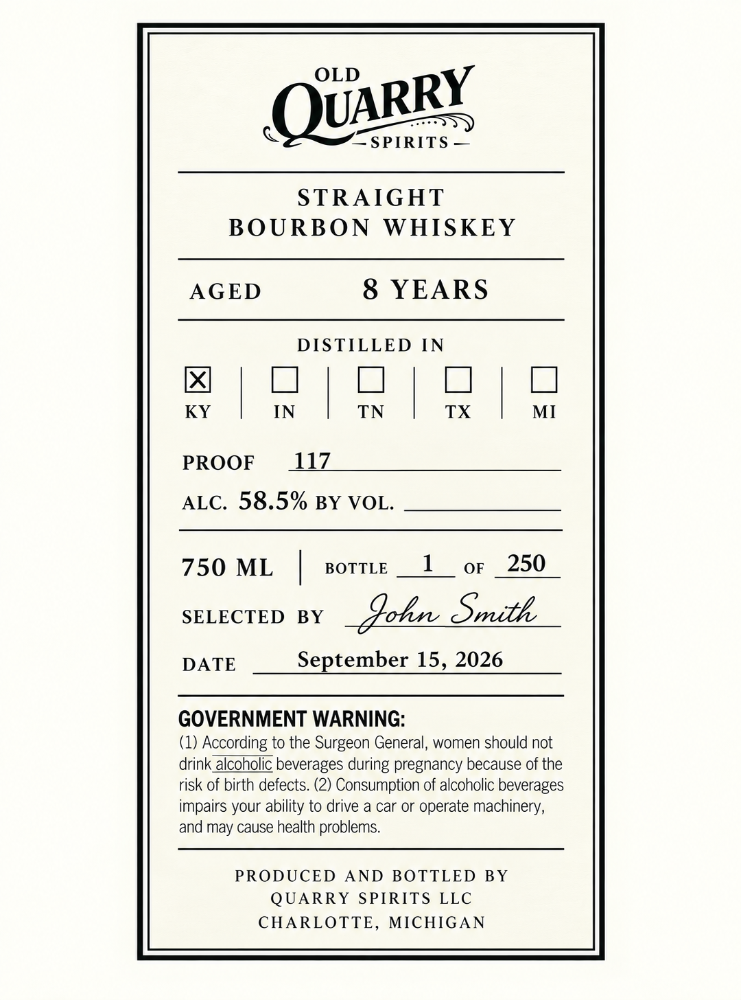

# TTB COLA Label Images - TTBID 26264001000395

**Brand Name:** OLD QUARRY SPIRITS

**Fanciful Name:** CUSTOM CASK SELECTION INDIANA

**Issue Date:** 09/29/2026

**Origin Code:** 06

**Product Class/Type:** 101

**Source:** [TTB Public COLA Registry](https://ttbonline.gov/colasonline/viewColaDetails.do?action=publicFormDisplay&ttbid=26264001000395)

## Label Images

### Label 1

## Extracted Label Text

*Text extracted via OCR - may contain errors*

**Detected Age:** 8 Years

### Label 1

OLD
SPIRITS
STRAIGHT
BOURBON
WHISKEY
AGED
8 YEARS
DISTILLED
IN
KY
IN
TN
TX
MI
PROOF
4Z
ALC. 58.5% BY VOL.
750 ML
BOTTLE
1
OF
250
SELECTED
BY
Aoly_Smith
DATE
September 15,.2026
GOVERNMENT WARNING:
(1) According to the Surgeon General, women should not
drink alcoholic beverages during pregnancy because of the
risk of birth defects. (2) Consumption of alcoholic beverages
impairs your ability to drive a car or operate machinery,
and may cause health problems
PRODUCED
AND
BOTTLED
BY
QUARRY
SPIRITS LLC
CHARLOTTE,
MICHIGAN
QUARRY
