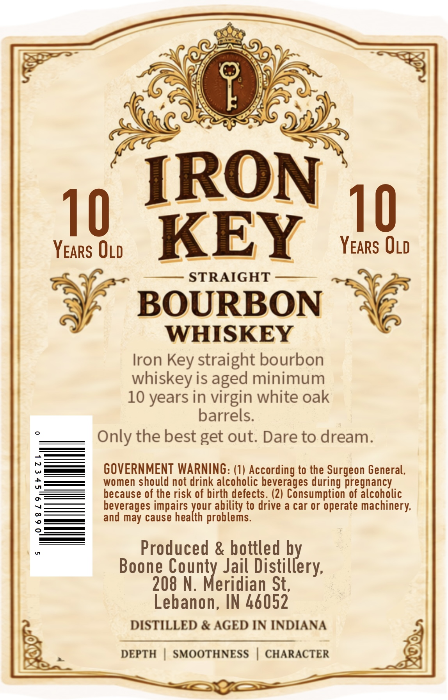
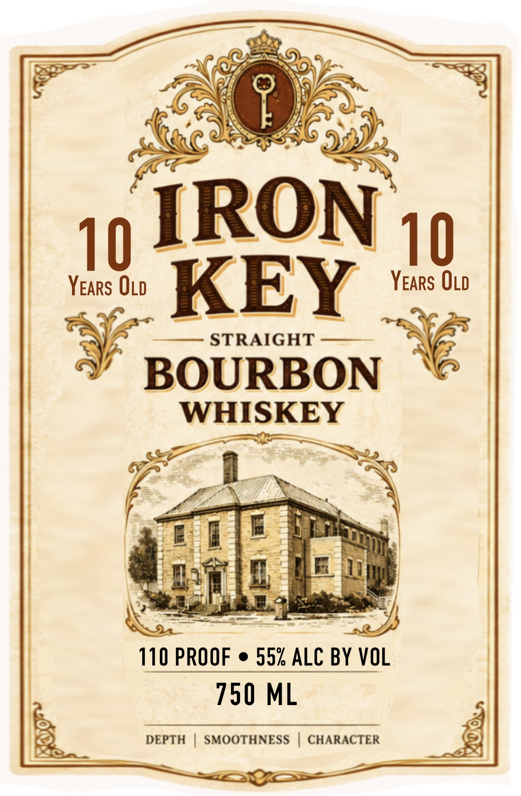

# TTB COLA Label Images - TTBID 26264001000411

**Brand Name:** IRON KEY

**Issue Date:** 09/24/2026

**Origin Code:** 19

**Product Class/Type:** 101

**Source:** [TTB Public COLA Registry](https://ttbonline.gov/colasonline/viewColaDetails.do?action=publicFormDisplay&ttbid=26264001000411)

## Label Images

### Back Label

### Front Label

## Extracted Label Text

*Text extracted via OCR - may contain errors*

**Detected Proof:** 110
**Detected Age:** 10 Years

### Back Label

IRON
10
10
YEARs OLd
KEY
YEARs OLd
STRAIGHT
BOURBON
WHISKEY
Iron
straight bourbon
whiskey is aged minimum
10 years in virgin white oak
barrels.
Only the best
out: Dare to dream_
:
GOVERNMENT WARNING: (I) According to the Surgeon General;,
women should not drink alcoholic beverages during pregnancy
because of the risk of birth defects. (2) Consumption of alcoholic
beverages impairs your ability to drive a car or operate machinery;
:
and may cause health problems.
Produced & bottled by
Boone County Jail Distillery;
208 N. Meridian St
Lebanon, IN 46052
DISTILLED & AGED IN INDIANA
DEPTH
SMOOTHNESS
CHARACTER
Key
get

### Front Label

10 IRON 1Q
YEARs OLd
KEY
Old
STRAIGHT
BOURBON
WHISKEY
110 PROOF
55% ALC BY VOL
750 ML
DEPTH
SMOOTHNESS
CHARACTER
YEARS
