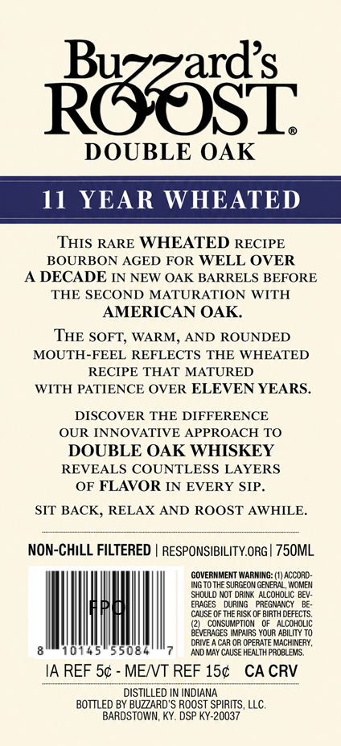
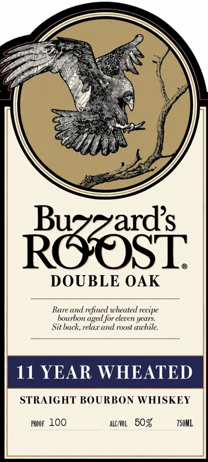

# TTB COLA Label Images - TTBID 26264001000431

**Brand Name:** BUZZARD"S ROOST

**Issue Date:** 09/23/2026

**Origin Code:** 22

**Product Class/Type:** 101

**Source:** [TTB Public COLA Registry](https://ttbonline.gov/colasonline/viewColaDetails.do?action=publicFormDisplay&ttbid=26264001000431)

## Label Images

### Back Label

### Label 1

## Extracted Label Text

*Text extracted via OCR - may contain errors*

**Detected Age:** 11 Years

### Back Label

Rcosi
DOUBLE OAK
11
YEAR WHEATED
THIS RARE WHEATED RECIPE
BOURBON AGED FOR WELL OVER
DECADE IN NEW OAK BARRELS BEFORE
THE SECOND MATURATION WITH
AMERICAN OAK
THE SOFT; WARM, AND ROUNDED
MOUTH-FEEL REFLECTS THE
WHEATED
RECIPE THAT MATURED
WITH PATIENCE OVER ELEVEN YEARS.
DISCOVER THE DIFFERENCE
OUR
INNOVATIVE APPROACH TO
DOUBLE OAK WHISKEY
REVEALS COUNTLESS LAYERS
OF FLAVOR IN EVERY SIP.
SIT BACK, RELAX AND ROOST AWHILE.
NON-CHILL FILTERED
RESPONSIBILITY.ORG | 750ML
GOVERMMENT WARMING: (1) ACCORD-
WGTo THE SURGEON GENERAL, WOMEN
Shoulo NOT drInk MLCOHOLIC BEV:
ERAGES
DURING
PREGNANCY
CAUSE 0F THE RISK 0F BIRTH DEFECTS
coksumpmion  QF
AlcOHOLIC
BQVERAGES IMPAURS YOUR ABILITY T0
DRIVE
CAR OR OPERATE MACHINERY ,
10145
5508
And May CauSE HEALIH PROBLEMS
IA REF 5c
MENT REF 15c
CA CRV
DISTILLED IN INDIANA
BOTTLED BY BUZZARD'S ROOST SPIRITS, LLC
BARDSTOWN; KY. DSP KY-20037

### Label 1

DOUBLE OAK

Rare and refined wheated recipe
bourbon aged for eleven years
Sit back, relax and roost awhile.

11 HEATED

STRAIGHT BOURBON WHISKEY

Poor LOO Agno. 50% 750M
