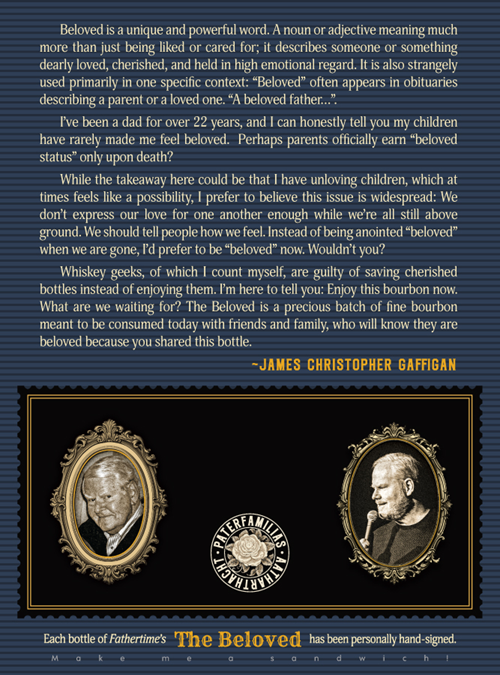
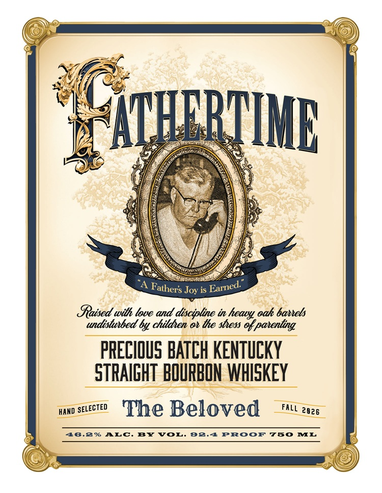
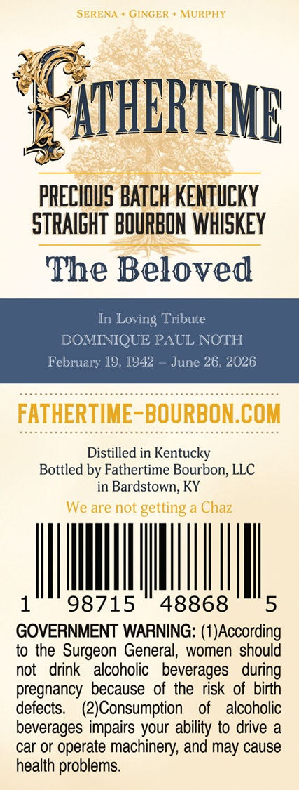

# TTB COLA Label Images - TTBID 26264001000457

**Brand Name:** FATHERTIME

**Issue Date:** 09/24/2026

**Origin Code:** 22

**Product Class/Type:** 101

**Source:** [TTB Public COLA Registry](https://ttbonline.gov/colasonline/viewColaDetails.do?action=publicFormDisplay&ttbid=26264001000457)

## Label Images

### Back Label

### Front Label

### Label 3

### Label 4

## Extracted Label Text

*Text extracted via OCR - may contain errors*

*1 image(s) excluded: text did not meet readability threshold*

**Detected Proof:** 96.4
**Detected Age:** 22 Years

### Back Label

Beloved is a unique and powerful word. A noun or adjective meaning much
more than just
liked or cared for; il describes someone Or
something
dearly loved; cherished, and held in high emotional regard. It is also strangely
used primarily in one specific context:
Beloved" often appears in obituaries
describing a parent or a loved one: "A beloved father;_"
Fve been
dad for over 22 years, and
can honestly tell you my children
have rarely made me fcel beloved   Perhaps parents officially carn "beloved
status" only upon death?
While the takeaway here could be that
have
unloving children; which at
times teels like
possibility;
prefer to believe this issue is widespread: We
don t express our love for one another enough while were all still above
ground We should tell people how we feel. Instead of being anointed "beloved"
when We are gone, Td prefer to be "beloved" now: Wouldn t you?
Whiskey geeks; of which
count
myself; are guilty of saving cherished
boltles instead
of enjoying them. Fm here to tell you: Enjoy this bourbon nOw:
What are We
waiting for? The Beloved is
precious batch of fine bourbon
meant to be consumed
today
friends and family; who will know they are
beloved because you shared this bottle.
JAMES CHRISTOPHER GAFFIGAN
Each bottle of Fathertime $
The Beloved
has been personally hand-signed.
being
With

### Front Label

ATHQRMHIB
Joy is
Gaised with love and discipline in
oak bavets
undistubed by childen o te sbess %& panenting
PRECIOUS BATCH KENTUCKY
STRAIGHT BOURBON WHISKEY
HAND
The Beloved
48.2%
ALC.
BY
VOL:
92.4
PROOF
760
ML
Earned:
Fathers
heavy
SELECTED
FALL
2026

### Label 4

SERENA
GINGER
MURPHY
ATHERTINL
PRECIOUS BATCH KENTUCKY
STRAIGHT BOURBON WhISKEY
The Beloved
In Loving Tribute
DOMINIQUE PAUL NOTH
February 19, 1942
June 26, 2026
FATHERTIME-BOURBON.COM
Distilled in Kentucky
Bottled by Fathertime Bourbon, LLC
in Bardstown; KY
We are not
getting
Chaz
1
98715
48868
5
GOVERNMENT WARNING: (1)According
to the Surgeon General, women should
not
drink
alcoholic
beverages
during
pregnancy because of the risk of birth
defects.
(2)Consumption
of
alcoholic
beverages impairs your ability to drive
car or operate
machinery; and may cause
health problems_
