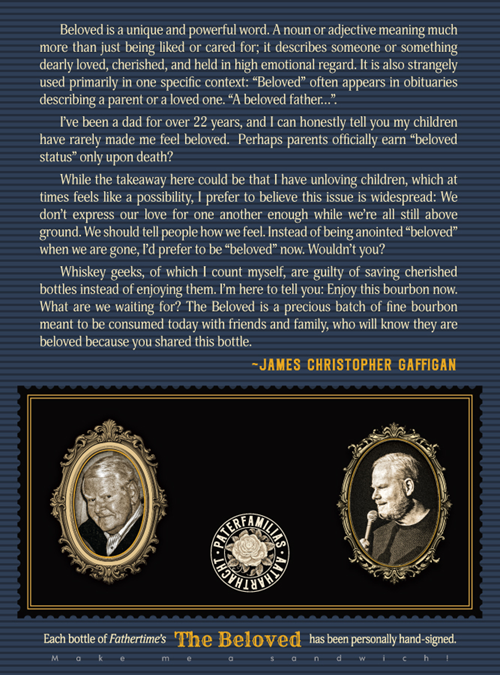
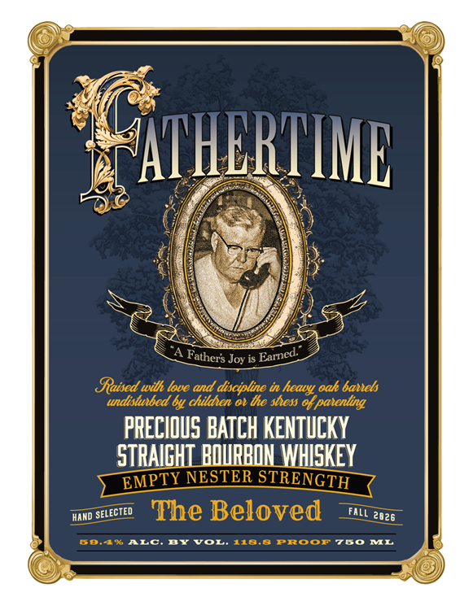
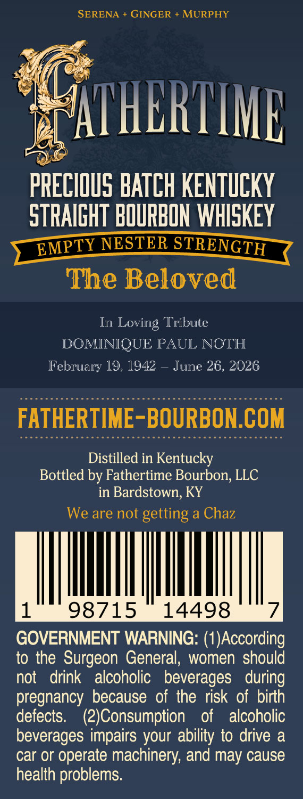

# TTB COLA Label Images - TTBID 26264001000473

**Brand Name:** FATHERTIME

**Issue Date:** 09/23/2026

**Origin Code:** 22

**Product Class/Type:** 101

**Source:** [TTB Public COLA Registry](https://ttbonline.gov/colasonline/viewColaDetails.do?action=publicFormDisplay&ttbid=26264001000473)

## Label Images

### Back Label

### Label 1

### Label 2

### Label 3

## Extracted Label Text

*Text extracted via OCR - may contain errors*

*1 image(s) excluded: text did not meet readability threshold*

**Detected Age:** 22 Years

### Back Label

Beloved is a unique and powerful word. A noun or adjective meaning much
more than just
liked or cared for; il describes someone Or
something
dearly loved; cherished, and held in high emotional regard. It is also strangely
used primarily in one specific context:
Beloved" often appears in obituaries
describing a parent or a loved one: "A beloved father;_"
Fve been
dad for over 22 years, and
can honestly tell you my children
have rarely made me fcel beloved   Perhaps parents officially carn "beloved
status" only upon death?
While the takeaway here could be that
have
unloving children; which at
times teels like
possibility;
prefer to believe this issue is widespread: We
don t express our love for one another enough while were all still above
ground We should tell people how we feel. Instead of being anointed "beloved"
when We are gone, Td prefer to be "beloved" now: Wouldn t you?
Whiskey geeks; of which
count
myself; are guilty of saving cherished
boltles instead
of enjoying them. Fm here to tell you: Enjoy this bourbon nOw:
What are We
waiting for? The Beloved is
precious batch of fine bourbon
meant to be consumed
today
friends and family; who will know they are
beloved because you shared this bottle.
JAMES CHRISTOPHER GAFFIGAN
Each bottle of Fathertime $
The Beloved
has been personally hand-signed.
being
With

### Label 1

ATHERIIMB
Joy is Earned
Saised
love and discipline in
oak banets
undistutbed by childien o1 the sess 0f patenting
PRECIOUS BATCH KENTuCKY
STRAICHI BOURBON WHISKEY
NESTER STRENGTH
HAND
The Beloved
2026
80,4*ALc
BYJor 118.8
Proor780
ML
Fathers
tilh
hcary
EMPTY
SELECTED
FLL

### Label 3

SERENA
GINGER
MURPHY
AIHERTIML
PRECIOuS BATCH KENTuCKY
STRAIGHT BOURBON WHISKEY
EMPTY NESTER STRENGTH
The Beloved
In
Loving Tribute
DOMINIQUE PAUL NOTH
February 19, 1942
June 26, 2026
FATHERTIME-BOURBON.COM
Distilled in Kentucky
Bottled by Fathertime Bourbon; LLC
in Bardstown; KY
We are not getting a Chaz
98715
14498
GOVERNMENT WARNING: (1)According
to the Surgeon General, women should
not
drink
alcoholic   beverages   during
pregnancy because of the risk of birth
defects:
(2JConsumption
of
alcoholic
beverages impairs your ability to drive a
car or operate machinery; and may cause
health problems:
